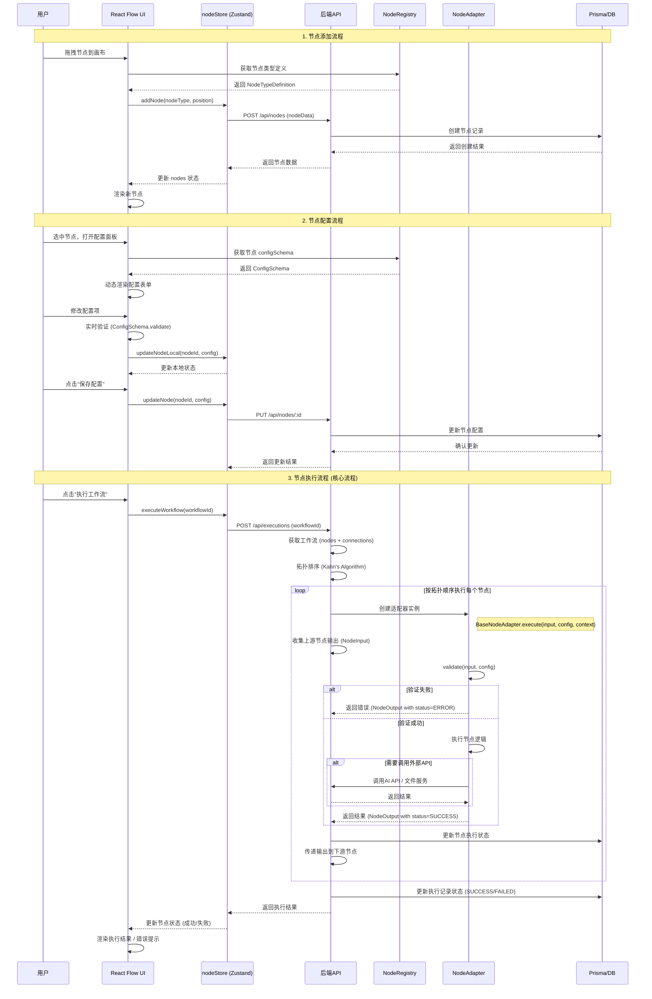
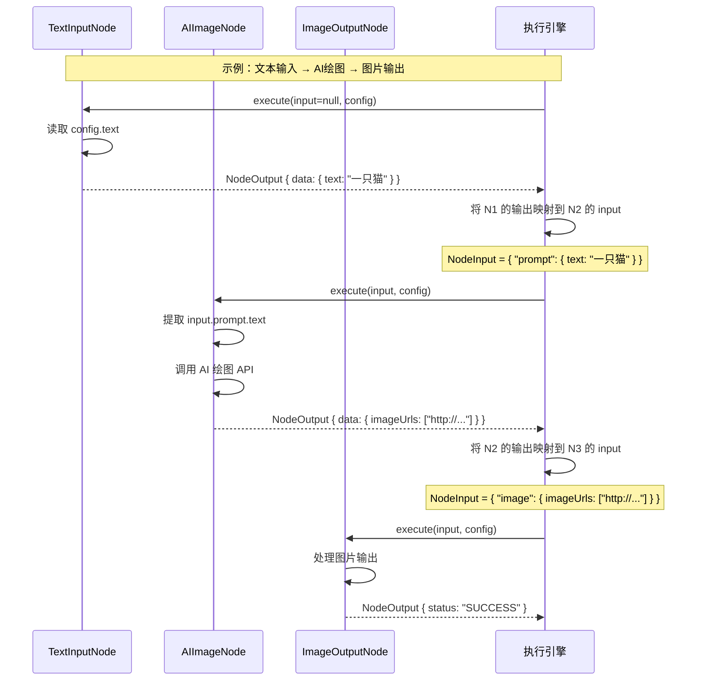
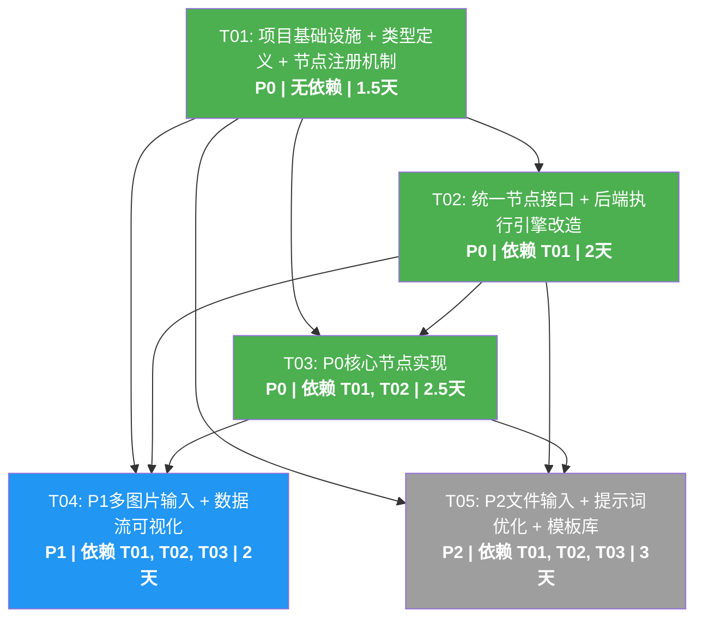

# KuKuDa 处理节点统一架构设计文档

> **项目**: KuKuDa AI Workflow Platform  
> **文档版本**: v1.0  
> **日期**: 2025-01-XX  
> **作者**: Bob (Software Architect)  
> **基于PRD**: PRD-kukuda-processing-nodes.md

---

## Part A: System Design

### 1. Implementation Approach

#### 1.1 核心技术挑战分析

| 挑战点 | 分析 | 解决方案 |
|--------|------|----------|
| 统一节点接口 | 现有节点（TextInput、AIImage、Skill）各自实现，缺乏统一接口规范 | 定义 `ProcessableNode` 接口 + `BaseNodeAdapter` 抽象类 |
| 节点间数据传递 | 当前数据流未标准化，节点输出格式不统一 | 定义标准化 `NodeOutput` 数据规范，支持多类型输出（text/image/file） |
| 动态节点注册 | 新增节点类型需要修改多处代码（nodeTypeMap、nodeLabelMap、index.ts等） | 实现 `NodeRegistry` 中心化注册机制 |
| 前端节点配置UI | 每个节点配置面板需要单独开发，重复代码多 | 基于 `NodeConfigSchema` 实现配置项动态渲染 |
| 后端节点执行 | 现有 `BaseAIAdapter` 仅支持AI调用，不覆盖所有节点类型 | 重构执行引擎，支持所有节点类型的统一执行接口 |

#### 1.2 框架和库选型

| 技术栈 | 选型 | 理由 |
|---------|------|------|
| 前端框架 | React 18 + TypeScript | 已有技术栈，保持一致性 |
| 流程图引擎 | React Flow | 已有集成，支持自定义节点 |
| UI组件库 | MUI + Tailwind CSS | 已有集成，MUI用于表单控件，Tailwind用于布局 |
| 状态管理 | Zustand | 已有 nodeStore，轻量级 |
| 后端框架 | Express + TypeScript | 已有技术栈 |
| ORM | Prisma | 已有集成，Node模型已定义 |
| 表单验证 | Zod | 类型安全的schema验证，适合节点配置验证 |

#### 1.3 架构模式

- **前端**: 组件化架构 + Registry 模式
- **后端**: 适配器模式（Adapter Pattern）+ 策略模式（Strategy Pattern）
- **数据流**: 单向数据流（React Flow 边连接定义数据流向）

---

### 2. File List

#### 2.1 前端文件（Frontend）

```
frontend/src/
├── types/
│   └── node.ts                          # 扩展现有类型定义（修改）
├── components/
│   └── canvas/
│       └── nodes/
│           ├── index.ts                  # 节点导出（修改）
│           ├── BaseNode.tsx              # 基础节点组件（修改）
│           ├── NodeRegistry.ts          # 节点注册中心（新建）
│           ├── TextInputNode.tsx         # 文本输入节点（修改）
│           ├── TextOutputNode.tsx        # 文本输出节点（修改）
│           ├── AIImageNode.tsx           # AI绘图节点（修改）
│           ├── SkillNode.tsx             # 技能节点（修改）
│           ├── ImageInputNode.tsx        # 多图片输入节点（新建，P1）
│           ├── FileInputNode.tsx         # 通用文件输入节点（新建，P2）
│           ├── PromptOptimizeNode.tsx    # 提示词优化节点（新建，P2）
│           └── configPanels/
│               ├── index.ts             # 配置面板导出（新建）
│               ├── BaseConfigPanel.tsx  # 基础配置面板组件（新建）
│               ├── TextInputConfig.tsx  # 文本输入配置面板（新建）
│               ├── AIImageConfig.tsx    # AI绘图配置面板（新建）
│               ├── ImageInputConfig.tsx  # 图片输入配置面板（新建，P1）
│               └── FileInputConfig.tsx  # 文件输入配置面板（新建，P2）
├── services/
│   └── nodeService.ts                  # 节点API服务（修改）
└── stores/
    └── nodeStore.ts                    # 节点状态管理（修改）
```

#### 2.2 后端文件（Backend）

```
backend/src/
├── types/
│   └── node.ts                         # 节点类型定义（新建）
├── services/
│   ├── nodeExecutionService.ts         # 节点执行服务（已存在，修改）
│   ├── ai/
│   │   ├── baseAdapter.ts              # AI适配器基类（已存在，修改）
│   │   └── nodeAdapters/
│   │       ├── index.ts                # 节点适配器导出（新建）
│   │       ├── BaseNodeAdapter.ts      # 节点适配器基类（新建）
│   │       ├── TextInputAdapter.ts     # 文本输入适配器（新建）
│   │       ├── TextOutputAdapter.ts    # 文本输出适配器（新建）
│   │       ├── AIImageAdapter.ts       # AI绘图适配器（新建）
│   │       ├── ImageInputAdapter.ts    # 图片输入适配器（新建，P1）
│   │       ├── FileInputAdapter.ts     # 文件输入适配器（新建，P2）
│   │       └── PromptOptimizeAdapter.ts # 提示词优化适配器（新建，P2）
│   └── nodeRegistryService.ts          # 节点注册服务（新建）
├── routes/
│   └── nodeRoutes.ts                  # 节点路由（修改）
└── utils/
    └── nodeValidator.ts               # 节点数据验证工具（新建）
```

#### 2.3 共享类型文件

```
shared/
└── types/
    └── node.ts                         # 前后端共享节点类型（新建）
```

---

### 3. Data Structures and Interfaces

#### 3.1 类图（Mermaid Class Diagram）

```mermaid
classDiagram
    %% ========== 前端节点组件体系 ==========
    class BaseNodeProps {
        +data: any
        +selected: boolean
        +type: string
        +label: string
        +icon: string
        +inputs: PortDefinition[]
        +outputs: PortDefinition[]
        +children: ReactNode
    }

    class ProcessableNodeInterface {
        <<interface>>
        +nodeType: NodeType
        +getInputs(): PortDefinition[]
        +getOutputs(): PortDefinition[]
        +validateConfig(config): boolean
        +execute(input): Promise~NodeOutput~
    }

    class NodeRegistry {
        -nodeTypes: Map~string, NodeTypeDefinition~
        +registerNodeType(definition): void
        +getNodeType(type): NodeTypeDefinition
        +getAllNodeTypes(): NodeTypeDefinition[]
        +getReactFlowNodeType(type): string
    }

    class NodeTypeDefinition {
        +type: string
        +label: string
        +icon: string
        +description: string
        +category: NodeCategory
        +configSchema: ConfigSchema
        +component: React.FC
        +adapterClass: BaseNodeAdapter
    }

    class PortDefinition {
        +id: string
        +label: string
        +dataType: DataType
    }

    class ConfigSchema {
        +fields: ConfigField[]
        +validate(values): ValidationResult
    }

    class ConfigField {
        +key: string
        +label: string
        +type: FieldType
        +required: boolean
        +defaultValue: any
        +options: Option[]
    }

    BaseNodeProps <|.. TextInputNode : implements
    BaseNodeProps <|.. AIImageNode : implements
    BaseNodeProps <|.. ImageInputNode : implements
    ProcessableNodeInterface <|.. TextInputNode : implements
    ProcessableNodeInterface <|.. AIImageNode : implements
    ProcessableNodeInterface <|.. ImageInputNode : implements
    NodeRegistry "1" *-- "*" NodeTypeDefinition : manages
    NodeTypeDefinition "1" *-- "1" ConfigSchema : has
    ConfigSchema "1" *-- "*" ConfigField : contains

    %% ========== 后端节点适配器体系 ==========
    class BaseNodeAdapter {
        <<abstract>>
        +nodeType: string
        +configSchema: ConfigSchema
        +validate(input, config): ValidationResult
        +execute(input, config, context): Promise~NodeOutput~
        +getMetadata(): NodeMetadata
    }

    class TextInputAdapter {
        +nodeType: "TEXT_INPUT"
        +execute(input, config): Promise~NodeOutput~
    }

    class AIImageAdapter {
        +nodeType: "AI_IMAGE"
        +execute(input, config): Promise~NodeOutput~
    }

    class ImageInputAdapter {
        +nodeType: "IMAGE_INPUT"
        +execute(input, config): Promise~NodeOutput~
    }

    class FileInputAdapter {
        +nodeType: "FILE_INPUT"
        +execute(input, config): Promise~NodeOutput~
    }

    BaseNodeAdapter <|-- TextInputAdapter : extends
    BaseNodeAdapter <|-- AIImageAdapter : extends
    BaseNodeAdapter <|-- ImageInputAdapter : extends
    BaseNodeAdapter <|-- FileInputAdapter : extends

    %% ========== 数据流类型 ==========
    class NodeOutput {
        +status: "SUCCESS" | "ERROR"
        +data: OutputData
        +error: ErrorInfo
        +metadata: ExecutionMetadata
    }

    class OutputData {
        +text: string
        +imageUrls: string[]
        +files: FileInfo[]
        +json: Record~string, any~
        +binary: Buffer
    }

    class ErrorInfo {
        +code: string
        +message: string
        +details: any
    }

    class ExecutionMetadata {
        +nodeId: string
        +executionTime: number
        +timestamp: Date
    }

    NodeOutput "1" *-- "1" OutputData : contains
    NodeOutput "0..1" *-- "1" ErrorInfo : may contain
    NodeOutput "1" *-- "1" ExecutionMetadata : has

    %% ========== 枚举类型 ==========
    class NodeType {
        <<enum>>
        TEXT_INPUT
        TEXT_OUTPUT
        AI_IMAGE
        IMAGE_INPUT
        FILE_INPUT
        PROMPT_OPTIMIZE
        SKILL
    }

    class DataType {
        <<enum>>
        TEXT
        IMAGE
        FILE
        JSON
        BINARY
        ANY
    }

    class NodeCategory {
        <<enum>>
        INPUT
        OUTPUT
        PROCESSING
        AI
        LOGIC
    }

    class FieldType {
        <<enum>>
        STRING
        NUMBER
        BOOLEAN
        SELECT
        MULTI_SELECT
        TEXTAREA
        FILE
        IMAGE
    }
```



#### 3.2 核心接口定义（TypeScript）

```typescript
// ========== 节点类型枚举 ==========
export enum NodeType {
  TEXT_INPUT = 'TEXT_INPUT',
  TEXT_OUTPUT = 'TEXT_OUTPUT',
  AI_IMAGE = 'AI_IMAGE',
  IMAGE_INPUT = 'IMAGE_INPUT',
  FILE_INPUT = 'FILE_INPUT',
  PROMPT_OPTIMIZE = 'PROMPT_OPTIMIZE',
  SKILL = 'SKILL',
}

// ========== 数据类型枚举 ==========
export enum DataType {
  TEXT = 'TEXT',
  IMAGE = 'IMAGE',
  FILE = 'FILE',
  JSON = 'JSON',
  BINARY = 'BINARY',
  ANY = 'ANY',
}

// ========== 节点分类枚举 ==========
export enum NodeCategory {
  INPUT = 'INPUT',
  OUTPUT = 'OUTPUT',
  PROCESSING = 'PROCESSING',
  AI = 'AI',
  LOGIC = 'LOGIC',
}

// ========== 端口定义 ==========
export interface PortDefinition {
  id: string;
  label: string;
  dataType: DataType;
}

// ========== 配置字段定义 ==========
export interface ConfigField {
  key: string;
  label: string;
  type: 'string' | 'number' | 'boolean' | 'select' | 'multiselect' | 'textarea' | 'file' | 'image';
  required: boolean;
  defaultValue: any;
  options?: Array<{ label: string; value: any }>;
  placeholder?: string;
  description?: string;
  min?: number;
  max?: number;
  validate?: (value: any) => ValidationError | null;
}

// ========== 配置Schema ==========
export interface ConfigSchema {
  fields: ConfigField[];
  validate: (values: Record<string, any>) => ValidationResult;
}

// ========== 验证结果 ==========
export interface ValidationResult {
  valid: boolean;
  errors: ValidationError[];
}

export interface ValidationError {
  field?: string;
  code: string;
  message: string;
}

// ========== 节点输出数据 ==========
export interface OutputData {
  text?: string;
  imageUrls?: string[];
  files?: Array<{
    name: string;
    url: string;
    type: string;
    size: number;
    metadata?: Record<string, any>;
  }>;
  json?: Record<string, any>;
  binary?: Buffer;
}

// ========== 错误信息 ==========
export interface ErrorInfo {
  code: string;
  message: string;
  details?: any;
}

// ========== 执行元数据 ==========
export interface ExecutionMetadata {
  nodeId: string;
  executionTime: number;
  timestamp: Date;
  upstreamNodeIds: string[];
}

// ========== 节点执行输出 ==========
export interface NodeOutput {
  status: 'SUCCESS' | 'ERROR' | 'RUNNING';
  data?: OutputData;
  error?: ErrorInfo;
  metadata?: ExecutionMetadata;
}

// ========== 节点输入 ==========
export interface NodeInput {
  [handleId: string]: OutputData | undefined;
}

// ========== 节点类型定义（注册用） ==========
export interface NodeTypeDefinition {
  type: string;
  label: string;
  icon: string;
  description: string;
  category: NodeCategory;
  configSchema: ConfigSchema;
  component: React.FC<any>;
  adapterClass: new () => BaseNodeAdapter;
  maxInstances?: number;
}

// ========== 节点元数据 ==========
export interface NodeMetadata {
  id: string;
  type: string;
  label: string;
  config: Record<string, any>;
  inputPorts: PortDefinition[];
  outputPorts: PortDefinition[];
  status: 'IDLE' | 'RUNNING' | 'SUCCESS' | 'ERROR';
  result?: NodeOutput;
  error?: string;
  createdAt: Date;
  updatedAt: Date;
}
```

---

### 4. Program Call Flow

#### 4.1 节点执行流程（Sequence Diagram）



#### 4.2 数据流在节点间传递的详细流程



---

### 5. Anything UNCLEAR

#### 5.1 需要确认的技术决策

| # | 待明确事项 | 当前假设 | 建议方案 |
|---|-----------|---------|---------|
| 1 | **节点执行是前端驱动还是后端驱动？** | 当前 `AIImageNode` 在前端直接调用 `/api/ai/images`，执行逻辑在前端 | 建议统一到后端执行，前端只负责触发和展示结果 |
| 2 | **节点间数据传递的粒度** | PRD要求"支持变量插值"，但未明确插值语法 | 建议采用 `{{nodeId.handleId}}` 语法，如 `{{textInput1.text}}` |
| 3 | **图片/文件的存储方案** | 未明确图片上传后存储位置 | 建议：小文件存Base64在数据库中，大文件上传到对象存储（如MinIO/S3） |
| 4 | **节点执行超时处理** | 未明确节点执行超时时间和重试策略 | 建议：默认30秒超时，AI节点可配置超时时间，失败不自动重试 |
| 5 | **P1多图片输入节点的UI交互** | 拖拽上传的具体交互未明确 | 建议：使用 react-dropzone 库，支持拖拽+点击上传，显示缩略图预览 |
| 6 | **P2提示词优化节点的NLP模型选型** | 未明确使用哪个NLP模型进行提示词优化 | 建议：复用已有的LLM调用能力（通过 `LLM_CALL` 节点），不单独引入新模型 |

#### 5.2 假设说明

1. **后端执行假设**：所有节点的执行逻辑都在后端完成，前端通过WebSocket或轮询获取执行状态。
2. **数据格式假设**：节点间传递的数据格式统一为 `NodeOutput`，包含 `data`、`error`、`metadata` 字段。
3. **错误处理假设**：节点执行失败时不阻断整个工作流，可选择忽略错误继续执行或停止。
4. **兼容性假设**：新架构保持与现有节点（TextInput、AIImage、Skill）的向后兼容。

---

## Part B: Task Decomposition

### 6. Required Packages

#### 6.1 前端新增依赖

```
# 节点配置表单验证
zod@^3.22.0
@hookform/resolvers@^3.3.0
react-hook-form@^7.48.0

# 文件上传（多图片/文件输入节点）
react-dropzone@^14.2.0

# 图片处理（EXIF解析、裁剪、压缩）
browser-image-compression@^2.0.0
piexifjs@^1.6.0

# 数据流可视化（P1）
reactflow@^11.10.0  # 已安装，确认版本

# 图标库（节点图标）
@iconify/react@^4.1.0
```

#### 6.2 后端新增依赖

```
# 数据验证
zod@^3.22.0

# 文件处理
sharp@^0.33.0          # 图片处理（裁剪、压缩、格式转换）
file-type@^18.5.0      # 文件类型检测
pdf-parse@^1.1.1       # PDF内容提取
mammoth@^1.6.0         # Word文档解析
xlsx@^0.18.5           # Excel解析

# 对象存储（可选，用于大文件存储）
@aws-sdk/client-s3@^3.450.0
```

---

### 7. Task List (ordered by dependency)

> **任务分解规则遵循**：
> - 最大 5 个任务
> - 每个任务至少 3 个相关文件
> - 第一个任务必须是"项目基础设施"
> - 按功能模块分组，不按单文件拆分

---

#### **Task #T01: 项目基础设施 + 类型定义 + 节点注册机制**

**优先级**: P0  
**依赖**: 无  
**预估工作量**: 1.5 天

**任务描述**:
搭建统一的类型定义体系，实现节点注册机制，为后续所有节点开发提供基础框架。

**源文件（8个文件）**:
1. `shared/types/node.ts` - 前后端共享类型定义（新建）
2. `frontend/src/types/node.ts` - 扩展现有类型（修改）
3. `frontend/src/components/canvas/nodes/NodeRegistry.ts` - 节点注册中心（新建）
4. `backend/src/types/node.ts` - 后端节点类型定义（新建）
5. `backend/src/services/nodeRegistryService.ts` - 节点注册服务（新建）
6. `backend/src/utils/nodeValidator.ts` - 节点数据验证工具（新建）
7. `frontend/src/components/canvas/nodes/index.ts` - 更新节点导出（修改）
8. `backend/src/services/ai/baseAdapter.ts` - 重构适配器基类（修改）

**主要交付物**:
- 统一的 `NodeType`、`DataType`、`NodeCategory` 枚举
- `NodeOutput`、`NodeInput`、`ConfigSchema` 等核心接口
- `NodeRegistry` 前端注册中心（支持动态注册）
- `nodeValidator.ts` 验证工具（基于 Zod）

---

#### **Task #T02: 统一节点接口 + 后端执行引擎改造**

**优先级**: P0  
**依赖**: T01  
**预估工作量**: 2 天

**任务描述**:
定义统一的 `ProcessableNode` 接口和 `BaseNodeAdapter` 抽象类，改造后端执行引擎以支持所有节点类型的统一执行。

**源文件（6个文件）**:
1. `backend/src/services/ai/nodeAdapters/BaseNodeAdapter.ts` - 节点适配器基类（新建）
2. `backend/src/services/ai/nodeAdapters/index.ts` - 适配器导出（新建）
3. `backend/src/services/nodeExecutionService.ts` - 执行引擎重构（修改）
4. `frontend/src/components/canvas/nodes/BaseNode.tsx` - 基础节点组件扩展（修改）
5. `frontend/src/stores/nodeStore.ts` - 扩展状态管理支持新接口（修改）
6. `backend/src/routes/nodeRoutes.ts` - 新增节点执行路由（修改）

**主要交付物**:
- `BaseNodeAdapter` 抽象类（所有节点适配器的基类）
- 重构 `executionService.ts` 以支持新的适配器体系
- `BaseNode.tsx` 支持 `NodeTypeDefinition` 中的 `configSchema`
- 统一的错误处理格式

---

#### **Task #T03: P0 核心节点实现（文本输入、文本输出、AI绘图）**

**优先级**: P0  
**依赖**: T01, T02  
**预估工作量**: 2.5 天

**任务描述**:
实现P0需求的三个核心处理节点，验证统一接口设计的正确性。

**源文件（9个文件）**:
1. `backend/src/services/ai/nodeAdapters/TextInputAdapter.ts` - 文本输入适配器（新建）
2. `backend/src/services/ai/nodeAdapters/TextOutputAdapter.ts` - 文本输出适配器（新建）
3. `backend/src/services/ai/nodeAdapters/AIImageAdapter.ts` - AI绘图适配器（新建）
4. `frontend/src/components/canvas/nodes/TextInputNode.tsx` - 文本输入节点重构（修改）
5. `frontend/src/components/canvas/nodes/TextOutputNode.tsx` - 文本输出节点重构（修改）
6. `frontend/src/components/canvas/nodes/AIImageNode.tsx` - AI绘图节点重构（修改）
7. `frontend/src/components/canvas/nodes/configPanels/BaseConfigPanel.tsx` - 基础配置面板（新建）
8. `frontend/src/components/canvas/nodes/configPanels/TextInputConfig.tsx` - 文本输入配置（新建）
9. `frontend/src/components/canvas/nodes/configPanels/AIImageConfig.tsx` - AI绘图配置（新建）

**主要交付物**:
- 3个后端节点适配器（TextInput、TextOutput、AIImage）
- 3个前端节点组件重构（接入 `NodeRegistry`）
- 配置面板动态渲染（基于 `ConfigSchema`）
- 文本输入验证（长度、特殊字符、编码）
- 变量插值功能（`{{nodeId.handleId}}` 语法）

---

#### **Task #T04: P1 多图片输入节点 + 数据流可视化**

**优先级**: P1  
**依赖**: T01, T02, T03  
**预估工作量**: 2 天

**任务描述**:
实现多图片输入节点（支持拖拽上传、元数据解析、图片预处理），以及数据流可视化功能。

**源文件（7个文件）**:
1. `backend/src/services/ai/nodeAdapters/ImageInputAdapter.ts` - 图片输入适配器（新建）
2. `frontend/src/components/canvas/nodes/ImageInputNode.tsx` - 多图片输入节点（新建）
3. `frontend/src/components/canvas/nodes/configPanels/ImageInputConfig.tsx` - 图片输入配置（新建）
4. `frontend/src/services/nodeService.ts` - 新增图片上传API（修改）
5. `backend/src/routes/nodeRoutes.ts` - 新增图片上传路由（修改）
6. `frontend/src/components/canvas/DataFlowVisualizer.tsx` - 数据流可视化组件（新建）
7. `frontend/src/styles/dataFlowAnimations.css` - 数据流动画样式（新建）

**主要交付物**:
- 多图片输入节点（拖拽/点击上传）
- 图片元数据解析（尺寸、格式、EXIF）
- 图片预处理（裁剪、压缩、格式转换，使用 `sharp`)
- 数据流转动画效果（React Flow edge animation）
- 中间结果查看功能

---

#### **Task #T05: P2 通用文件输入 + 提示词优化 + 节点模板库**

**优先级**: P2  
**依赖**: T01, T02, T03  
**预估工作量**: 3 天

**任务描述**:
实现P2需求的通用文件输入节点、提示词优化节点，以及节点模板库功能。

**源文件（10个文件）**:
1. `backend/src/services/ai/nodeAdapters/FileInputAdapter.ts` - 文件输入适配器（新建）
2. `backend/src/services/ai/nodeAdapters/PromptOptimizeAdapter.ts` - 提示词优化适配器（新建）
3. `frontend/src/components/canvas/nodes/FileInputNode.tsx` - 通用文件输入节点（新建）
4. `frontend/src/components/canvas/nodes/PromptOptimizeNode.tsx` - 提示词优化节点（新建）
5. `frontend/src/components/canvas/nodes/configPanels/FileInputConfig.tsx` - 文件输入配置（新建）
6. `frontend/src/components/canvas/NodeTemplateLibrary.tsx` - 节点模板库组件（新建）
7. `frontend/src/services/templateService.ts` - 模板服务API（新建）
8. `backend/src/routes/templateRoutes.ts` - 模板路由（新建）
9. `backend/src/services/templateService.ts` - 模板服务端逻辑（新建）
10. `frontend/src/stores/templateStore.ts` - 模板状态管理（新建）

**主要交付物**:
- 通用文件输入节点（PDF/Word/Excel/TXT）
- 文件格式自动识别和内容提取
- 提示词优化节点（接入LLM）
- 优化前后对比展示
- 节点模板库（预置模板 + 自定义模板保存/分享）

---

### 8. Shared Knowledge

#### 8.1 跨文件约定

##### 命名规范

| 类型 | 命名规则 | 示例 |
|------|---------|------|
| 节点类型枚举 | `UPPER_SNAKE_CASE` | `TEXT_INPUT`, `AI_IMAGE` |
| 前端节点组件 | `PascalCase` + `Node` 后缀 | `TextInputNode`, `AIImageNode` |
| 后端节点适配器 | `PascalCase` + `Adapter` 后缀 | `TextInputAdapter`, `AIImageAdapter` |
| 配置面板组件 | `PascalCase` + `Config` 后缀 | `TextInputConfig`, `AIImageConfig` |
| 端口ID | `camelCase` | `text`, `image`, `fileList` |
| 配置文件 | `kebab-case` | `node-registry.ts`, `base-adapter.ts` |

##### 错误处理约定

```typescript
// 标准错误格式（前后端统一）
interface StandardError {
  code: string;      // 错误代码，如 "VAL_001", "EXEC_002"
  message: string;   // 用户友好的错误信息（中文）
  details?: any;     // 详细错误信息（开发调试用，不展示给用户）
}

// 错误代码规则
// VAL_xxx: 验证错误
// EXEC_xxx: 执行错误
// IO_xxx: 输入输出错误
// API_xxx: 外部API调用错误
```

##### 日志规范

```typescript
// 日志级别
// - debug: 详细的调试信息（仅开发环境）
// - info: 关键操作日志（如节点执行开始/结束）
// - warn: 警告信息（如配置项缺失但有默认值）
// - error: 错误信息（记录完整错误堆栈）

// 日志格式
// [NodeType:节点ID] 消息内容
// 示例: [AI_IMAGE:node_123] 开始执行，prompt="一只猫"
```

##### API响应格式

```typescript
// 所有API响应统一格式
interface ApiResponse<T> {
  code: number;     // 0 表示成功，非0表示失败
  data: T;          // 响应数据
  message: string;  // 响应消息
}
```

#### 8.2 节点开发Checklist

开发新节点时，请确保完成以下所有项：

**后端适配器**:
- [ ] 继承 `BaseNodeAdapter`
- [ ] 实现 `execute` 方法
- [ ] 实现 `validate` 方法（输入验证）
- [ ] 定义 `configSchema`（配置项验证）
- [ ] 错误处理使用 `StandardError` 格式
- [ ] 添加单元测试

**前端组件**:
- [ ] 继承 `BaseNode` 组件
- [ ] 实现 `ProcessableNodeInterface` 接口
- [ ] 定义 `inputs` 和 `outputs` 端口
- [ ] 注册到 `NodeRegistry`
- [ ] 创建对应的配置面板组件
- [ ] 支持 `collapsed` 状态
- [ ] 支持拖拽调整大小（`NodeResizer`）

**文档**:
- [ ] 在 `NodeTypeDefinition.description` 中添加节点描述
- [ ] 在 `ConfigField.description` 中添加配置项说明
- [ ] 更新 `docs/architecture-processing-nodes.md`（如有架构变更）

---

### 9. Task Dependency Graph



---

## Appendix A: 现有代码修改点详细说明

### A.1 `frontend/src/types/node.ts` 修改点

```typescript
// 新增内容：
export enum DataType { ... }           // 新增数据类型枚举
export interface PortDefinition { ... } // 新增端口定义
export interface ConfigSchema { ... }   // 新增配置Schema
export interface NodeOutput { ... }     // 新增节点输出格式
export interface NodeInput { ... }      // 新增节点输入格式

// 修改内容：
export enum NodeType {
  // 新增 IMAGE_INPUT, FILE_INPUT, PROMPT_OPTIMIZE
  IMAGE_INPUT = 'IMAGE_INPUT',
  FILE_INPUT = 'FILE_INPUT',
  PROMPT_OPTIMIZE = 'PROMPT_OPTIMIZE',
}
```

### A.2 `frontend/src/components/canvas/nodes/BaseNode.tsx` 修改点

```typescript
// 修改 BaseNodeProps 接口，新增：
export interface BaseNodeProps {
  data: any;
  selected?: boolean;
  type: string;
  label: string;
  icon: string;
  inputs?: PortDefinition[];     // 改为使用 PortDefinition
  outputs?: PortDefinition[];    // 改为使用 PortDefinition
  configSchema?: ConfigSchema;    // 新增：配置Schema
  onConfigChange?: (config: Record<string, any>) => void;  // 新增：配置变更回调
  children?: React.ReactNode;
}
```

### A.3 `backend/src/services/nodeExecutionService.ts` 修改点

```typescript
// 重构 executeNode 方法，使用新的适配器体系：
async executeNode(node: any, previousResults: Record<string, NodeResult>): Promise<NodeResult> {
  // 不再使用 BaseAIAdapter，改为使用 BaseNodeAdapter
  const adapter = this.getNodeAdapter(node.type);
  if (!adapter) {
    return { error: `不支持的节点类型: ${node.type}` };
  }

  // 验证配置
  const validation = adapter.validate(node.config);
  if (!validation.valid) {
    return { error: `配置验证失败: ${validation.errors.map(e => e.message).join(', ')}` };
  }

  // 准备输入数据
  const input = this.getNodeInput(node.id, previousResults);

  // 执行节点
  const context = { executionId: this.executionId, userId: this.userId };
  const result = await adapter.execute(input, node.config, context);

  return result;
}
```

---

## Appendix B: 节点配置JSON示例

### B.1 文本输入节点配置

```json
{
  "nodeType": "TEXT_INPUT",
  "label": "用户输入",
  "config": {
    "placeholder": "请输入文本...",
    "maxLength": 5000,
    "allowVariables": true,
    "defaultValue": ""
  }
}
```

### B.2 AI绘图节点配置

```json
{
  "nodeType": "AI_IMAGE",
  "label": "生成图片",
  "config": {
    "model": "dall-e-3",
    "size": "1024x1024",
    "count": 1,
    "quality": "standard",
    "style": "vivid"
  }
}
```

### B.3 图片输入节点配置（P1）

```json
{
  "nodeType": "IMAGE_INPUT",
  "label": "上传图片",
  "config": {
    "maxFiles": 10,
    "maxFileSize": 10,
    "allowedFormats": ["jpg", "png", "webp"],
    "enableCompression": true,
    "compressionQuality": 80,
    "extractMetadata": true
  }
}
```

---

## Appendix C: 测试策略

### C.1 单元测试

| 测试对象 | 测试框架 | 覆盖点 |
|---------|---------|--------|
| 后端适配器 | Jest + ts-jest | 正常执行、错误处理、输入验证 |
| 前端组件 | Vitest + React Testing Library | 渲染、用户交互、状态管理 |
| 工具函数 | Jest | `nodeValidator`、`NodeRegistry` |

### C.2 集成测试

- 节点执行流程端到端测试
- 节点间数据传递测试
- 错误传播测试

### C.3 手动测试Checklist

- [ ] 添加/删除/连接节点
- [ ] 节点配置保存/加载
- [ ] 工作流执行（成功/失败场景）
- [ ] 图片上传功能
- [ ] 数据流可视化动画

---

## Document History

| Version | Date | Author | Changes |
|---------|------|--------|---------|
| v1.0 | 2025-01-XX | Bob | 初始版本 |

---

**END OF DOCUMENT**
