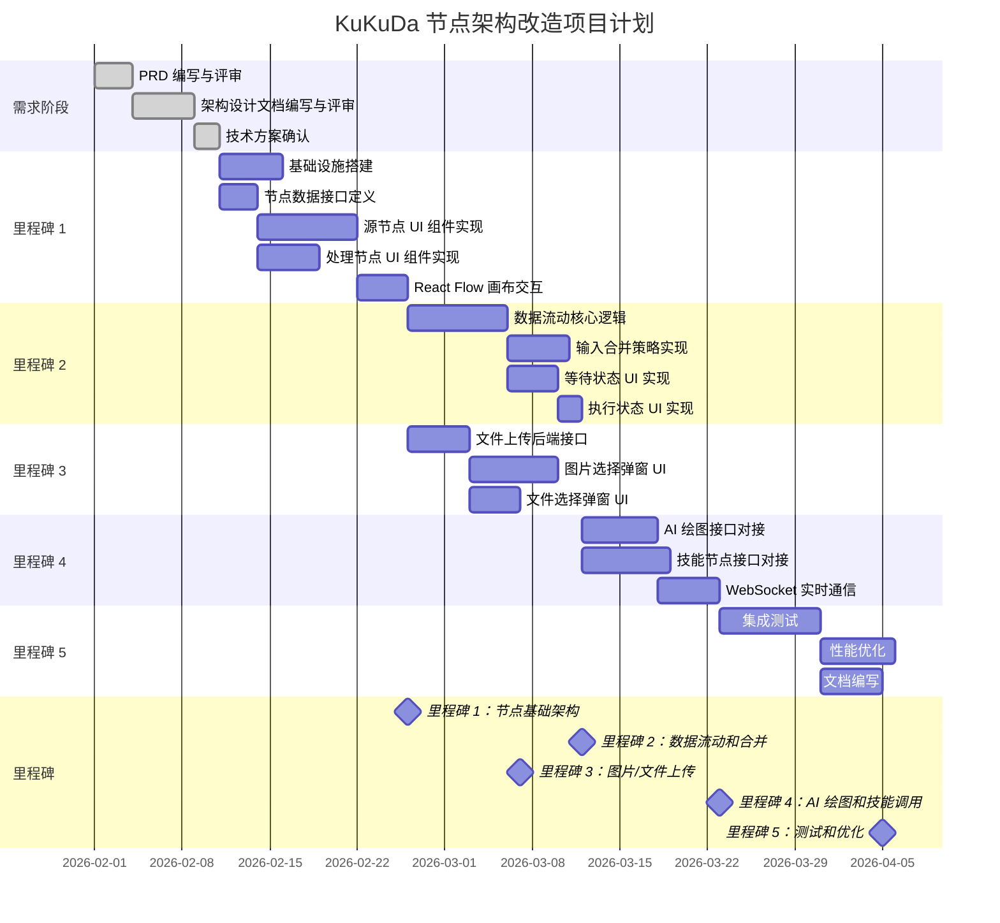

# KuKuDa 节点架构改造项目计划

**版本**: v1.0.0  
**日期**: 2026-02-10  
**项目经理**: 节进  
**状态**: 待审批

---

## 版本历史

| 版本号 | 日期 | 作者 | 变更说明 |
|--------|------|------|----------|
| v1.0.0 | 2026-02-10 | 节进 | 初始版本，基于 PRD v1.0.0 和架构设计 v1.0.0 制定项目计划 |

---

## 目录

1. [项目概述](#1-项目概述)
2. [WBS 工作分解结构](#2-wbs-工作分解结构)
3. [项目时间表与里程碑](#3-项目时间表与里程碑)
4. [资源计划](#4-资源计划)
5. [风险清单](#5-风险清单)
6. [沟通计划](#6-沟通计划)
7. [质量保障计划](#7-质量保障计划)

---

## 1. 项目概述

### 1.1 项目背景

KuKuDa 是一个基于 React Flow 画布的 AI 工作流构建工具。当前节点架构存在分类不清晰、数据流动规则不明确、多输入合并策略缺失、UI 交互不一致等问题。本项目旨在对节点架构进行全面改造，提升用户体验和系统可维护性。

### 1.2 项目目标

- 明确节点分类（源节点 vs 处理节点，共 8 种节点类型）
- 规范数据流动规则（被动读取、等待策略）
- 定义输入合并策略（追加拼接）
- 统一 UI 交互设计
- 实现技术架构落地（Zustand + MinIO + 后端代理）

### 1.3 成功标准

- 所有 8 种节点类型可正常使用（5 种源节点 + 3 种处理节点）
- 数据流动符合被动读取原则，无循环触发
- 多输入合并策略正确实现
- 文件上传功能稳定（支持图片/文件，最大数量符合要求）
- AI 绘图和技能调用功能正常
- 性能指标：10 个节点工作流执行时间 < 5 秒
- 无严重 bug，文档完整

### 1.4 关键假设与约束

**假设**：
- 团队成员熟练掌握 React、TypeScript、React Flow
- MinIO 对象存储服务可正常部署和访问
- AI 绘图接口（Stable Diffusion 或同类服务）可用
- 项目期间核心开发人员不离职

**约束**：
- 总工期：8 周（40 个工作日）
- 团队规模：固定（详见资源计划）
- 技术栈已确定（React + Zustand + Express + PostgreSQL + MinIO）

---

## 2. WBS 工作分解结构

> **估算说明**：
> - 估算单位：人天（1 人天 = 1 人工作 8 小时）
> - 估算方法：三点估算（乐观 + 4×最可能 + 悲观）÷ 6，并增加 20% 缓冲
> - 责任角色：R = 负责人，A = 审批人，C = 咨询对象，I = 知情者

### 2.0 需求阶段（已完成为后续参考）

#### 2.1 需求分析与确认
- **任务 2.1.1**：PRD 编写与评审 | 估算：3 人天 | 负责人：茗需 | 依赖：无
- **任务 2.1.2**：架构设计文档编写与评审 | 估算：5 人天 | 负责人：杉架 | 依赖：2.1.1
- **任务 2.1.3**：技术方案确认（状态管理、存储方案、AI 调用方式） | 估算：2 人天 | 负责人：杉架 | 依赖：2.1.2

### 2.1 里程碑 1：节点基础架构（第 1-2 周）

#### 2.2 技术选型与基础设施搭建
- **任务 2.2.1**：前端项目初始化（React + TypeScript + Vite） | 估算：1 人天 | 负责人：柏码 | 依赖：2.1.3
- **任务 2.2.2**：Zustand Store 设计与实现 | 估算：2 人天 | 负责人：柏码 | 依赖：2.2.1
- **任务 2.2.3**：后端项目初始化（Express + Prisma） | 估算：1 人天 | 负责人：柏码 | 依赖：2.1.3
- **任务 2.2.4**：MinIO 对象存储部署与集成 | 估算：2 人天 | 负责人：柏码 | 依赖：2.2.3
- **任务 2.2.5**：PostgreSQL + Redis 数据库搭建 | 估算：1 人天 | 负责人：柏码 | 依赖：2.2.3

#### 2.3 节点数据接口定义（TypeScript 类型）
- **任务 2.3.1**：基础节点数据接口定义（BaseNodeData） | 估算：0.5 人天 | 负责人：柏码 | 依赖：2.2.2
- **任务 2.3.2**：源节点数据接口定义（5 种） | 估算：1 人天 | 负责人：柏码 | 依赖：2.3.1
- **任务 2.3.3**：处理节点数据接口定义（3 种） | 估算：0.5 人天 | 负责人：柏码 | 依赖：2.3.1
- **任务 2.3.4**：Prisma Schema 设计与迁移 | 估算：1 人天 | 负责人：柏码 | 依赖：2.2.5

#### 2.4 源节点 UI 组件实现（5 种）
- **任务 2.4.1**：文本输入节点（TextInputNode） | 估算：1.5 人天 | 负责人：柏码 | 依赖：2.3.2
- **任务 2.4.2**：单图片输入节点（SingleImageInputNode） | 估算：2 人天 | 负责人：柏码 | 依赖：2.3.2, 2.2.4
- **任务 2.4.3**：多图片输入节点（MultiImageInputNode） | 估算：2.5 人天 | 负责人：柏码 | 依赖：2.4.2
- **任务 2.4.4**：单文件输入节点（SingleFileInputNode） | 估算：1.5 人天 | 负责人：柏码 | 依赖：2.3.2, 2.2.4
- **任务 2.4.5**：多文件输入节点（MultiFileInputNode） | 估算：2 人天 | 负责人：柏码 | 依赖：2.4.4

#### 2.5 处理节点 UI 组件实现（3 种）
- **任务 2.5.1**：AI 绘图节点（AIImageNode）基础 UI | 估算：2 人天 | 负责人：柏码 | 依赖：2.3.3
- **任务 2.5.2**：文本输出节点（TextOutputNode） | 估算：1 人天 | 负责人：柏码 | 依赖：2.3.3
- **任务 2.5.3**：技能节点（SkillNode）基础 UI | 估算：2 人天 | 负责人：柏码 | 依赖：2.3.3

#### 2.6 React Flow 画布基础交互
- **任务 2.6.1**：节点拖拽、连接、删除功能 | 估算：2 人天 | 负责人：柏码 | 依赖：2.4.1, 2.5.2
- **任务 2.6.2**：节点句柄样式与连接线样式定制 | 估算：1 人天 | 负责人：柏码 | 依赖：2.6.1
- **任务 2.6.3**：画布缩放、平移、迷你地图 | 估算：1 人天 | 负责人：柏码 | 依赖：2.6.1

**里程碑 1 合计**：约 26 人天（按 1 人全职约 5.5 工作日）

### 2.2 里程碑 2：数据流动和合并（第 3-4 周）

#### 2.7 数据流动核心逻辑实现
- **任务 2.7.1**：Zustand 派生状态实现（getUpstreamOutputs） | 估算：2 人天 | 负责人：柏码 | 依赖：2.2.2
- **任务 2.7.2**：工作流执行引擎（WorkflowExecutor） | 估算：3 人天 | 负责人：柏码 | 依赖：2.7.1
- **任务 2.7.3**：被动读取逻辑实现（不主动触发上游） | 估算：1.5 人天 | 负责人：柏码 | 依赖：2.7.2
- **任务 2.7.4**：BFS 遍历算法实现（按边方向执行） | 估算：1.5 人天 | 负责人：柏码 | 依赖：2.7.2

#### 2.8 输入合并策略实现
- **任务 2.8.1**：文本合并策略（换行符拼接） | 估算：1 人天 | 负责人：柏码 | 依赖：2.7.1
- **任务 2.8.2**：图片/文件 URL 合并（数组合并） | 估算：1 人天 | 负责人：柏码 | 依赖：2.7.1
- **任务 2.8.3**：多种类型合并策略（按类型分别处理） | 估算：1.5 人天 | 负责人：柏码 | 依赖：2.8.1, 2.8.2
- **任务 2.8.4**：合并冲突处理（根据节点类型采用不同策略） | 估算：1.5 人天 | 负责人：柏码 | 依赖：2.8.3

#### 2.9 等待状态 UI 实现
- **任务 2.9.1**：等待状态节点样式（黄色边框、"等待上游数据..."） | 估算：1 人天 | 负责人：柏码 | 依赖：2.7.3
- **任务 2.9.2**：Tooltip 提示（"正在等待上游节点输出数据"） | 估算：0.5 人天 | 负责人：柏码 | 依赖：2.9.1
- **任务 2.9.3**：上游数据变化监听与自动触发 | 估算：2 人天 | 负责人：柏码 | 依赖：2.7.1

#### 2.10 执行状态 UI 实现
- **任务 2.10.1**：执行中状态（蓝色边框、进度条/动画） | 估算：1 人天 | 负责人：柏码 | 依赖：2.7.2
- **任务 2.10.2**：成功状态（绿色边框、"✓ 执行成功"、显示结果） | 估算：0.5 人天 | 负责人：柏码 | 依赖：2.10.1
- **任务 2.10.3**：失败状态（红色边框、"✗ 执行失败"、错误信息 Tooltip） | 估算：0.5 人天 | 负责人：柏码 | 依赖：2.10.1

**里程碑 2 合计**：约 18 人天（约 3.5 工作日）

### 2.3 里程碑 3：图片/文件上传（第 5 周）

#### 2.11 文件上传后端接口实现
- **任务 2.11.1**：单文件上传接口（POST /api/upload/single） | 估算：1.5 人天 | 负责人：柏码 | 依赖：2.2.4, 2.2.3
- **任务 2.11.2**：批量文件上传接口（POST /api/upload/batch） | 估算：2 人天 | 负责人：柏码 | 依赖：2.11.1
- **任务 2.11.3**：文件删除接口 | 估算：0.5 人天 | 负责人：柏码 | 依赖：2.11.1
- **任务 2.11.4**：MinIO 集成测试 | 估算：1 人天 | 负责人：柏码 | 依赖：2.11.2

#### 2.12 图片选择弹窗 UI 实现
- **任务 2.12.1**：单图片选择弹窗（深色主题、选择文件、拖拽、Ctrl+V） | 估算：2.5 人天 | 负责人：柏码 | 依赖：2.11.1
- **任务 2.12.2**：批量图片上传弹窗（深色主题、批量选择、自动编号 1-20、清空） | 估算：3 人天 | 负责人：柏码 | 依赖：2.11.2, 2.12.1
- **任务 2.12.3**：图片预览网格（缩略图、编号、文件名、删除按钮） | 估算：1.5 人天 | 负责人：柏码 | 依赖：2.12.2

#### 2.13 文件选择弹窗 UI 实现
- **任务 2.13.1**：单文件选择弹窗 | 估算：1.5 人天 | 负责人：柏码 | 依赖：2.11.1
- **任务 2.13.2**：多文件选择弹窗（不限制数量或限制 50 个） | 估算：2 人天 | 负责人：柏码 | 依赖：2.11.2, 2.13.1

**里程碑 3 合计**：约 15 人天（约 3 工作日）

### 2.4 里程碑 4：AI 绘图和技能调用（第 6-7 周）

#### 2.14 AI 绘图接口对接
- **任务 2.14.1**：后端 AI 绘图接口代理（POST /api/ai/image-generation） | 估算：2 人天 | 负责人：柏码 | 依赖：2.2.3
- **任务 2.14.2**：AI 服务选型与测试（Stable Diffusion / DALL-E / 其他） | 估算：1.5 人天 | 负责人：杉架 | 依赖：2.1.3
- **任务 2.14.3**：前端 AI 绘图节点完整功能（prompt 输入、生成按钮、图片预览） | 估算：2.5 人天 | 负责人：柏码 | 依赖：2.14.1, 2.5.1

#### 2.15 技能节点接口对接
- **任务 2.15.1**：技能管理后端接口（列表、详情、执行） | 估算：2 人天 | 负责人：柏码 | 依赖：2.2.3, 2.2.4
- **任务 2.15.2**：技能节点配置弹窗（动态表单生成） | 估算：3 人天 | 负责人：柏码 | 依赖：2.5.3, 2.15.1
- **任务 2.15.3**：技能接口调用与结果处理 | 估算：2 人天 | 负责人：柏码 | 依赖：2.15.1

#### 2.16 WebSocket 实时通信
- **任务 2.16.1**：后端 WebSocket 服务（Socket.io） | 估算：1.5 人天 | 负责人：柏码 | 依赖：2.2.3
- **任务 2.16.2**：前端 WebSocket 集成（节点状态实时更新） | 估算：2 人天 | 负责人：柏码 | 依赖：2.16.1
- **任务 2.16.3**：执行状态推送（node:status-change、workflow:complete） | 估算：1 人天 | 负责人：柏码 | 依赖：2.16.2

**里程碑 4 合计**：约 18 人天（约 3.5 工作日）

### 2.5 里程碑 5：测试和优化（第 8 周）

#### 2.17 集成测试
- **任务 2.17.1**：所有节点类型功能测试 | 估算：2 人天 | 负责人：棘检 | 依赖：2.4, 2.7, 2.12, 2.14
- **任务 2.17.2**：所有数据流场景测试（被动读取、等待、合并） | 估算：2 人天 | 负责人：棘检 | 依赖：2.17.1
- **任务 2.17.3**：端到端测试（从源节点到终端节点） | 估算：1.5 人天 | 负责人：棘检 | 依赖：2.17.2
- **任务 2.17.4**：Bug 修复 | 估算：3 人天 | 负责人：柏码 | 依赖：2.17.3

#### 2.18 性能优化
- **任务 2.18.1**：大数据量传递性能测试与优化（20 张图片 URL 数组） | 估算：2 人天 | 负责人：柏码 | 依赖：2.17.3
- **任务 2.18.2**：复杂工作流布局计算性能优化（50+ 节点） | 估算：2 人天 | 负责人：柏码 | 依赖：2.17.3
- **任务 2.18.3**：工作流执行速度优化（目标：10 个节点 < 5 秒） | 估算：1.5 人天 | 负责人：柏码 | 依赖：2.18.1

#### 2.19 文档编写
- **任务 2.19.1**：用户文档（节点使用说明、常见问题） | 估算：2 人天 | 负责人：茗需 | 依赖：2.17.3
- **任务 2.19.2**：开发文档（架构设计、接口定义、扩展指南） | 估算：2 人天 | 负责人：杉架 | 依赖：2.17.3
- **任务 2.19.3**：部署文档（环境配置、部署步骤） | 估算：1 人天 | 负责人：柏码 | 依赖：2.18

**里程碑 5 合计**：约 19 人天（约 4 工作日）

### 2.6 缓冲时间

- **任务 2.20.1**：不可预见风险缓冲 | 估算：8 人天 | 负责人：节进 | 依赖：无

**项目总计**：约 104 人天 + 8 人天缓冲 = 112 人天

> **人天换算说明**：
> - 按 1 人全职工作：112 人天 ÷ 5 天/周 = 约 22.4 工作日
> - 按团队协同工作（见资源计划）：实际需要 8 周（40 个工作日）

---

## 3. 项目时间表与里程碑

### 3.1 任务依赖关系图



> **注意**：由于 Mermaid 甘特图在 Markdown 中渲染可能不完整，建议使用专业项目管理工具（如 Microsoft Project、GanttProject）打开附录中的详细时间表。

### 3.2 里程碑详情

| 里程碑 | 名称 | 计划完成日期 | 交付物 | 验收标准 |
|--------|------|-------------|--------|----------|
| 🎯 M1 | 节点基础架构 | 第 2 周末 | 所有节点 UI 组件、画布基础交互 | 可在画布上拖拽创建所有类型节点，可连接节点，节点显示正确 UI |
| 🎯 M2 | 数据流动和合并 | 第 4 周末 | 数据流动核心逻辑、输入合并策略、等待/执行状态 UI | 处理节点可读取上游输出，多输入可正确合并，上游无输出时显示等待状态 |
| 🎯 M3 | 图片/文件上传 | 第 5 周末 | 文件上传接口、图片/文件选择弹窗 | 可点击选择/拖拽上传/ Ctrl+V 粘贴图片，批量上传自动编号 1-20 |
| 🎯 M4 | AI 绘图和技能调用 | 第 7 周末 | AI 绘图功能、技能节点功能、WebSocket 实时通信 | AI 绘图节点可生成图片，技能节点可调用外部 API，执行状态实时更新 |
| 🎯 M5 | 测试和优化 | 第 8 周末 | 测试报告、性能优化、完整文档 | 所有功能正常工作无严重 bug，10 个节点工作流执行 < 5 秒，文档完整准确 |

### 3.3 关键路径分析

**关键路径**（决定项目总工期的最短任务序列）：

```
技术方案确认 → 基础设施搭建 → 节点数据接口定义 → 源节点 UI 组件实现 → React Flow 画布交互
→ 数据流动核心逻辑 → 输入合并策略实现 → 等待状态 UI 实现 → 执行状态 UI 实现
→ AI 绘图接口对接 → 技能节点接口对接 → WebSocket 实时通信
→ 集成测试 → 性能优化 → 文档编写
```

**关键路径总长度**：约 40 个工作日（8 周）

**可并行任务**（非关键路径，可加速项目进度）：
- 处理节点 UI 组件实现（与源节点 UI 组件实现可部分并行）
- 文件上传后端接口（与数据流动核心逻辑可并行）
- 图片/文件选择弹窗 UI（在文件上传后端接口完成后）
- 文档编写（可在集成测试阶段并行开始）

---

## 4. 资源计划

### 4.1 团队角色与职责

| 角色 | 姓名 | 主要职责 | 可用时间 |
|------|------|----------|----------|
| **产品经理** | 茗需 | PRD 编写、需求确认、用户文档编写 | 第 1 周（3 人天）、第 8 周（2 人天） |
| **架构师** | 杉架 | 架构设计、技术选型、开发文档编写、AI 服务选型 | 第 1 周（5 人天）、第 8 周（2 人天） |
| **全栈开发工程师** | 柏码 | 前端+后端开发、数据库设计、接口实现、性能优化 | 全职（8 周 × 5 天 = 40 人天 + 缓冲） |
| **测试工程师** | 棘检 | 测试计划编写、功能测试、性能测试、测试报告 | 第 8 周（6 人天） + 前期介入（2 人天） |
| **项目经理** | 节进 | 项目规划、进度跟踪、风险管理、资源协调 | 全程（每周 1 人天，共 8 人天） |

### 4.2 资源分配时间表

| 周次 | 茗需（产品） | 杉架（架构） | 柏码（开发） | 棘检（测试） | 节进（PM） |
|------|-------------|-------------|-------------|-------------|-----------|
| **第 1 周** | 3 人天（PRD） | 5 人天（架构设计） | 0 | 0 | 1 人天（项目启动） |
| **第 2 周** | 0 | 2 人天（技术方案确认） | 5 人天（M1 基础设施+接口定义） | 0 | 1 人天（进度跟踪） |
| **第 3 周** | 0 | 0 | 5 人天（M1 节点组件+画布） | 0.5 人天（测试计划） | 1 人天（进度跟踪） |
| **第 4 周** | 0 | 1.5 人天（AI 选型） | 5 人天（M2 数据流动+合并） | 0.5 人天（测试用例） | 1 人天（进度跟踪） |
| **第 5 周** | 0 | 0 | 5 人天（M3 文件上传+弹窗） | 1 人天（前期测试） | 1 人天（进度跟踪） |
| **第 6 周** | 0 | 0 | 5 人天（M4 AI 绘图+技能） | 1 人天（持续测试） | 1 人天（进度跟踪） |
| **第 7 周** | 0 | 0 | 5 人天（M4 WebSocket+联调） | 1 人天（持续测试） | 1 人天（进度跟踪） |
| **第 8 周** | 2 人天（用户文档） | 2 人天（开发文档） | 5 人天（M5 测试+优化+文档） | 6 人天（集成测试+报告） | 1 人天（收尾） |
| **合计** | 5 人天 | 10.5 人天 | 40 人天 | 10 人天 | 8 人天 |

### 4.3 资源风险与应对

| 风险 | 影响 | 应对措施 |
|------|------|----------|
| 柏码（核心开发）离职或病假 | 高 | 1. 知识文档化（代码注释、技术文档）<br>2. 交叉培训（杉架可临时接手）<br>3. 关键任务双人备份 |
| 测试工程师资源不足 | 中 | 1. 开发人员自测（单元测试+集成测试）<br>2. 产品经理协助用户验收测试<br>3. 必要时外包部分测试工作 |
| AI 服务选型延迟 | 中 | 1. 先使用 Mock 接口开发前端<br>2. 并行评估多个 AI 服务商<br>3. 预留 1 周缓冲时间 |

---

## 5. 风险清单

> **风险值计算**：风险值 = 概率 × 影响
> - 概率：高（3）、中（2）、低（1）
> - 影响：高（3）、中（2）、低（1）
> - 风险值：9-6 为高，5-3 为中，2-1 为低

| ID | 风险描述 | 类别 | 概率 | 影响 | 风险值 | 状态 | 应对措施 | 责任人 | 触发条件 |
|----|----------|------|------|------|--------|------|----------|--------|----------|
| **R1** | 大数据量传递导致性能问题（20 张图片 URL 数组） | 性能 | 中（2） | 中（2） | **4（中）** | 开放 | 1. 节点间只传递 URL，不传递 Base64 数据<br>2. 使用虚拟滚动（react-window）<br>3. 数据分片传递（每次 5 张） | 柏码 | 节点传递数据量 > 10MB |
| **R2** | 复杂工作流布局计算性能问题（50+ 节点） | 性能 | 中（2） | 中（2） | **4（中）** | 开放 | 1. 使用 dagre 库进行布局优化<br>2. 限制单个工作流最大节点数（100 个）<br>3. 懒加载（只渲染可见区域节点） | 柏码 | 工作流节点数 > 50 个 |
| **R3** | API Key 泄露（前端直接调用 AI 接口） | 安全 | 高（3） | 高（3） | **9（高）** | 已缓解 | 1. **已确认方案**：AI 接口调用统一走后端代理<br>2. 后端限流（每个用户每分钟最多 10 次）<br>3. 监控异常 API 调用 | 杉架 | AI 接口调用失败率 > 10% |
| **R4** | 文件上传漏洞（恶意文件、超大文件） | 安全 | 中（2） | 高（3） | **6（高）** | 开放 | 1. 文件类型限制（图片只允许 jpg、png 等）<br>2. 文件大小限制（图片最大 10MB，文件最大 100MB）<br>3. 病毒扫描（集成 ClamAV）<br>4. 文件名随机化 | 柏码 | 上传文件类型不在白名单内 |
| **R5** | AI 服务不可用（宕机、维护等） | 可用性 | 中（2） | 中（2） | **4（中）** | 开放 | 1. 重试机制（最多 3 次）<br>2. 降级方案（提示用户稍后重试）<br>3. 多服务商切换（配置多个 AI 服务商） | 杉架 | AI 服务错误率 > 50% |
| **R6** | WebSocket 连接断开（网络不稳定） | 可用性 | 高（3） | 低（1） | **3（中）** | 开放 | 1. Socket.io 自带自动重连机制<br>2. 轮询兜底（WebSocket 断开后改用轮询）<br>3. 用户提示（"网络连接已断开，正在重试..."） | 柏码 | WebSocket 连接断开超过 30 秒 |
| **R7** | 节点类型扩展成本高（每次新增节点需修改多处代码） | 扩展性 | 中（2） | 中（2） | **4（中）** | 开放 | 1. 节点配置化（节点定义存储在配置文件）<br>2. 动态注册（前端根据配置动态注册节点组件）<br>3. 插件化（将节点实现为插件，支持动态加载） | 杉架 | 新增节点类型耗时 > 3 人天 |
| **R8** | 技能接口不兼容（第三方技能接口格式不统一） | 扩展性 | 中（2） | 中（2） | **4（中）** | 开放 | 1. 定义标准接口规范（RESTful + JSON Schema）<br>2. 适配器模式（对于不兼容的技能，编写适配器）<br>3. 审核机制（技能上架前经过审核） | 杉架 | 技能接口调用失败率 > 20% |
| **R9** | 核心开发人员离职 | 资源 | 低（1） | 高（3） | **3（中）** | 开放 | 1. 知识文档化<br>2. 交叉培训<br>3. 关键任务双人备份 | 节进 | 人员提出离职 |
| **R10** | AI 服务选型延迟导致开发阻塞 | 进度 | 中（2） | 高（3） | **6（高）** | 开放 | 1. 先使用 Mock 接口开发前端<br>2. 并行评估多个 AI 服务商<br>3. 预留 1 周缓冲时间 | 节进 | AI 服务选型超过 1 周未确定 |

### 5.1 高风险优先级排序

1. **R3：API Key 泄露**（风险值 9）→ 已缓解（采用后端代理方案）
2. **R4：文件上传漏洞**（风险值 6）→ 需重点防范
3. **R10：AI 服务选型延迟**（风险值 6）→ 需提前决策
4. **R5：AI 服务不可用**（风险值 4）→ 需制定降级方案

---

## 6. 沟通计划

### 6.1 会议计划

| 会议类型 | 频率 | 参与者 | 目的 | 时长 |
|----------|------|--------|------|------|
| **每日站会** | 每天上午 9:30 | 柏码、棘检（可选） | 同步进度、识别阻碍 | 15 分钟 |
| **周会** | 每周五下午 3:00 | 全员（茗需、杉架、柏码、棘检、节进） | 进度汇报、风险讨论、下周计划 | 1 小时 |
| **里程碑评审会** | 每个里程碑结束时 | 全员 + 干系人（可选） | 交付物验收、下一步决策 | 1.5 小时 |
| **技术评审会** | 按需（通常第 2 周末、第 4 周末） | 杉架、柏码、节进 | 技术方案评审、代码审查 | 1 小时 |
| **项目启动会** | 第 1 周初 | 全员 | 项目目标对齐、角色职责确认 | 1 小时 |
| **项目总结会** | 第 8 周末 | 全员 + 干系人 | 项目总结、经验复盘 | 1.5 小时 |

### 6.2 沟通渠道

| 沟通渠道 | 用途 | 响应时间要求 |
|----------|------|-------------|
| **企业微信** | 日常沟通、问题讨论 | 工作时间内 2 小时内回复 |
| **邮件** | 正式文档传递、审批流程 | 1 个工作日内回复 |
| **GitHub Issues** | Bug 跟踪、功能讨论 | 1 个工作日内分配处理人 |
| **腾讯文档** | 文档协作（PRD、架构设计、项目计划） | 实时协作 |
| **WorkBuddy** | AI 辅助开发、代码生成 | 实时 |

### 6.3 报告机制

| 报告类型 | 频率 | 负责人 | 接收人 | 内容 |
|----------|------|--------|--------|------|
| **日报** | 每天 | 柏码 | 节进 | 今日完成工作、明日计划、遇到的问题 |
| **周报** | 每周五 | 节进 | 全员 | 本周进度、下周计划、风险与问题 |
| **里程碑报告** | 每个里程碑结束时 | 节进 | 全员 + 干系人 | 交付物清单、质量评估、偏差分析 |
| **测试报告** | 第 8 周 | 棘检 | 全员 | 测试用例执行结果、Bug 统计、质量评估 |
| **项目总结报告** | 项目结束时 | 节进 | 全员 + 干系人 | 项目目标达成情况、经验教训、改进建议 |

---

## 7. 质量保障计划

### 7.1 质量目标

- **功能覆盖率**：100%（所有节点类型、所有数据流场景）
- **测试用例通过率**：≥ 95%
- **Bug 修复时间**：严重 Bug 24 小时内修复，一般 Bug 3 个工作日内修复
- **性能达标率**：100%（10 个节点工作流执行时间 < 5 秒）
- **文档完整率**：100%（用户文档、开发文档、部署文档）

### 7.2 质量标准

| 类型 | 标准 | 验收方法 |
|------|------|----------|
| **代码质量** | 1. 代码注释覆盖率 ≥ 30%<br>2. 单元测试覆盖率 ≥ 60%<br>3. 代码审查通过率 100% | 代码审查、单元测试报告 |
| **功能质量** | 1. 所有功能符合 PRD 和架构设计<br>2. UI 符合设计规范<br>3. 接口符合接口定义 | 功能测试、UI 走查、接口测试 |
| **性能质量** | 1. 10 个节点工作流执行时间 < 5 秒<br>2. 页面加载时间 < 2 秒<br>3. API 接口响应时间 < 500ms | 性能测试报告 |
| **安全质量** | 1. 无 SQL 注入、XSS 等常见漏洞<br>2. API Key 不暴露在前端<br>3. 文件上传无漏洞 | 安全扫描报告、代码审查 |

### 7.3 测试计划

| 测试类型 | 负责人 | 开始时间 | 结束时间 | 测试方法 |
|----------|--------|----------|----------|----------|
| **单元测试** | 柏码 | 第 2 周 | 第 7 周 | Jest + React Testing Library |
| **集成测试** | 棘检 | 第 8 周 | 第 8 周 | 手动测试 + 自动化测试脚本 |
| **性能测试** | 柏码 | 第 8 周 | 第 8 周 | Lighthouse + 自定义性能测试脚本 |
| **安全测试** | 棘检 | 第 8 周 | 第 8 周 | OWASP ZAP + 代码审查 |
| **用户验收测试** | 茗需 | 第 8 周 | 第 8 周 | 真实场景测试 |

---

## 8. 附录

### 8.1 详细时间表（可导入项目管理工具）

> **注**：以下时间表可导入 Microsoft Project、GanttProject 等工具生成详细甘特图。

```
任务ID,任务名称,责任人,工期(天),前置任务,开始时间,结束时间
1,PRD 编写与评审,茗需,3,,2026-02-01,2026-02-03
2,架构设计文档编写与评审,杉架,5,1,2026-02-04,2026-02-10
3,技术方案确认,杉架,2,2,2026-02-11,2026-02-12
4,前端项目初始化,柏码,1,3,2026-02-13,2026-02-13
5,Zustand Store 设计与实现,柏码,2,4,2026-02-14,2026-02-15
...
```

（完整时间表见项目管理系统）

### 8.2 参考资料

- [KuKuDa 产品需求文档 (PRD) v1.0.0](./node-architecture-v1.0.0.md)
- [KuKuDa 节点架构改造架构设计文档 v1.0.0](./node-architecture-design-v1.0.0.md)
- [React Flow 官方文档](https://reactflow.dev/)
- [Zustand 官方文档](https://github.com/pmndrs/zustand)
- [MinIO 官方文档](https://min.io/docs)
- [Prisma 官方文档](https://www.prisma.io/docs)

---

**文档结束**

---

## 审批记录

| 角色 | 姓名 | 审批意见 | 日期 |
|------|------|----------|------|
| 产品负责人 | 茗需 | 待审批 |  |
| 技术负责人 | 杉架 | 待审批 |  |
| 项目经理 | 节进 | 待审批 |  |
| 测试负责人 | 棘检 | 待审批 |  |

---

**备注**：
1. 本文档为 v1.0.0 版本，基于 PRD v1.0.0 和架构设计 v1.0.0 编写。
2. 项目计划可根据实际执行情况动态调整，调整后需经项目经理审批。
3. 风险清单需在每周周会中审查，更新风险状态和应对措施。
4. 本文档使用 Markdown 格式编写，可使用任何文本编辑器或 Markdown 编辑器打开。
