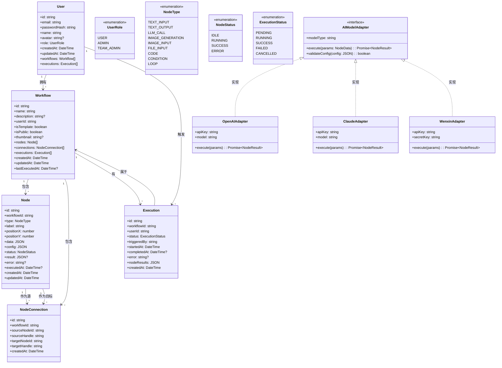
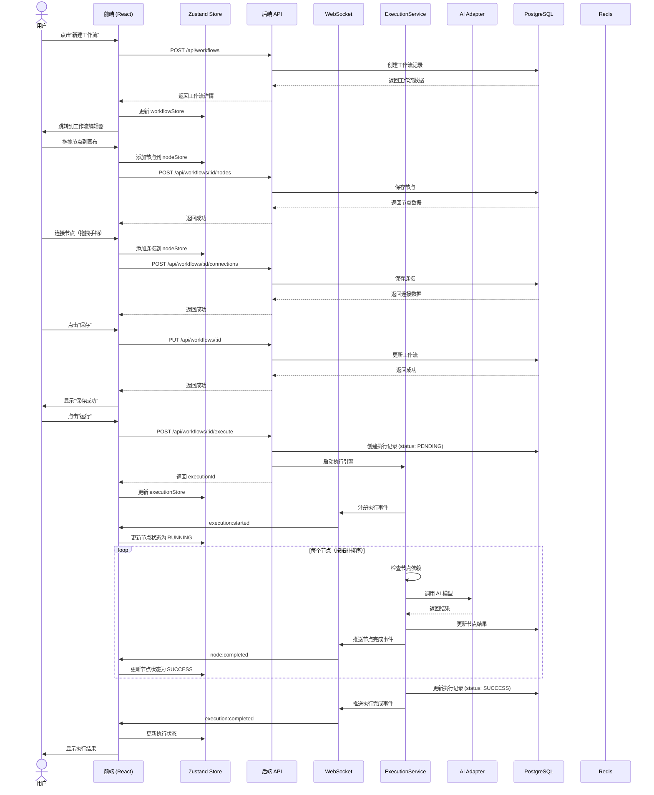
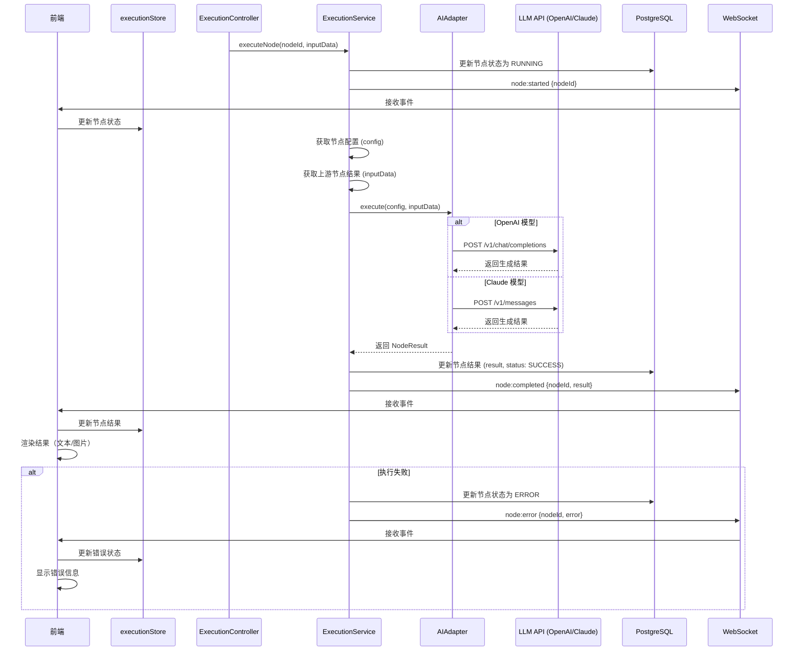
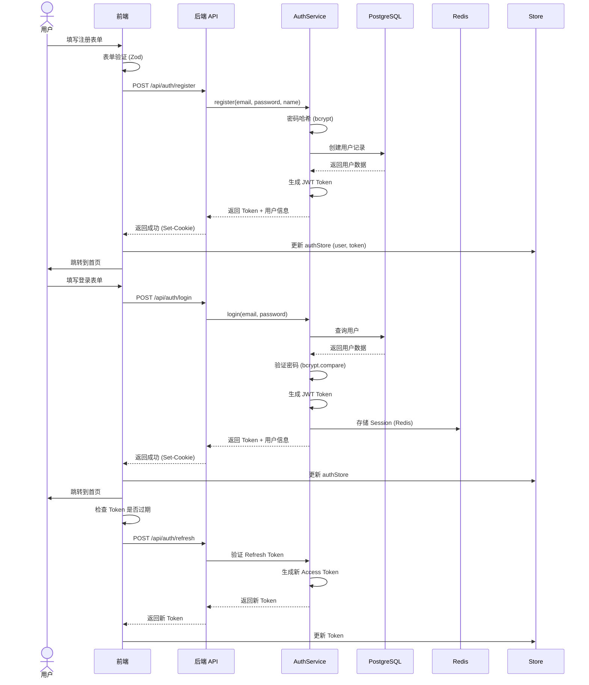
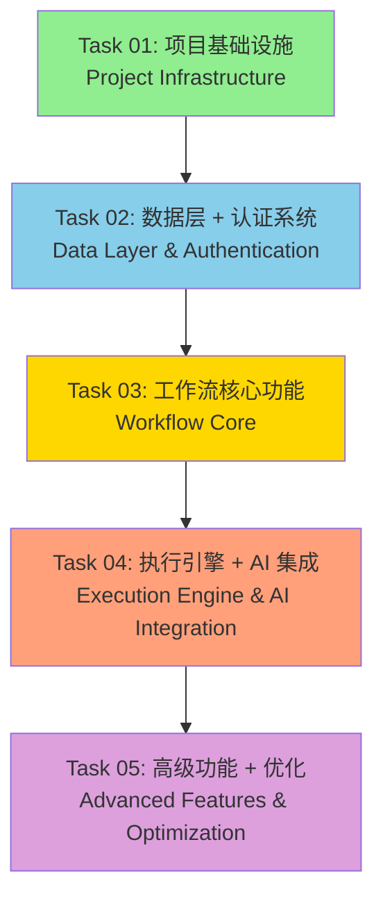

# 系统架构设计文档
## 工作流画布平台 (Workflow Canvas Platform)

**文档版本**: v1.0  
**创建日期**: 2026-07-15  
**架构师**: Bob (Software Architect)  
**审核状态**: 待审核

---

## Part A: 系统设计

### 1. 实现方案

#### 1.1 核心技术难点分析

1. **节点画布引擎**: 需要支持拖拽、连接、缩放等复杂交互，React Flow 是最佳选择
2. **工作流执行引擎**: 需要处理节点间的依赖关系、串行/并行执行、错误处理
3. **实时状态推送**: 节点执行状态需要实时反馈到前端
4. **多模型集成**: 统一接入多种大模型 API，需要处理不同 API 的差异
5. **状态管理**: 前端需要管理复杂的画布状态、节点状态、执行状态

#### 1.2 技术栈选型及理由

**前端技术栈**:
- **React 18 + TypeScript**: 类型安全，生态成熟，适合大型项目
- **React Flow**: 专业的节点画布库，社区活跃，扩展性强
- **Material-UI (MUI)**: 组件丰富，支持主题切换（深色/浅色）
- **Zustand**: 轻量级状态管理，API 简洁，适合管理画布状态
- **Vite**: 快速的构建工具，开发体验好
- **React Query (@tanstack/react-query)**: 数据获取和缓存
- **Zod**: 运行时类型校验和表单验证

**后端技术栈**:
- **Node.js + Express + TypeScript**: 前后端语言统一，适合实时应用
- **PostgreSQL**: 关系型数据库，适合存储用户、工作流、执行记录等结构化数据
- **Redis**: 缓存、Session 管理、实时状态存储
- **Socket.io**: WebSocket 实时通信，支持降级到轮询
- **Prisma**: 类型安全的 ORM，迁移管理方便

**AI 模型集成**:
- **OpenAI API**: GPT-4/GPT-3.5
- **Anthropic API**: Claude
- **百度文心一言 API**
- **阿里通义千问 API**

**选型理由**:
1. **React Flow vs Vue Flow**: React 生态更大，React Flow 社区更活跃，文档更完善
2. **Node.js vs Python FastAPI**: 实时通信场景 Node.js 更合适，前后端语言统一降低开发成本
3. **PostgreSQL vs MongoDB**: 工作流数据关系复杂（用户-工作流-节点-连接），关系型数据库更合适
4. **WebSocket vs SSE**: 需要双向通信（前端取消执行、后端推送状态），WebSocket 更合适

#### 1.3 架构模式

- **前端**: 组件化架构 + 状态管理模式
- **后端**: MVC 架构 + 分层设计（Controller-Service-Repository）
- **实时通信**: 事件驱动架构
- **AI 集成**: 适配器模式（统一不同模型 API 的接口）

---

### 2. 文件列表

#### 2.1 前端文件 (Frontend)

```
frontend/
├── index.html
├── package.json
├── tsconfig.json
├── vite.config.ts
├── .env.example
├── public/
│   └── favicon.ico
└── src/
    ├── main.tsx                      # 应用入口
    ├── App.tsx                       # 根组件
    ├── vite-env.d.ts                # Vite 类型声明
    ├── types/                        # 类型定义
    │   ├── index.ts                  # 导出所有类型
    │   ├── node.ts                   # 节点类型定义
    │   ├── workflow.ts               # 工作流类型定义
    │   ├── api.ts                    # API 响应类型
    │   └── store.ts                  # Store 类型定义
    ├── constants/                     # 常量定义
    │   ├── nodeTypes.ts              # 节点类型常量
    │   ├── api.ts                    # API 端点常量
    │   └── theme.ts                  # 主题常量
    ├── config/                       # 配置文件
    │   └── index.ts                  # 环境配置
    ├── hooks/                        # 自定义 Hooks
    │   ├── useAuth.ts                # 认证 Hook
    │   ├── useWorkflow.ts            # 工作流 Hook
    │   ├── useExecution.ts           # 执行 Hook
    │   ├── useSocket.ts              # WebSocket Hook
    │   └── useUndoRedo.ts           # 撤销重做 Hook
    ├── stores/                       # Zustand Store
    │   ├── authStore.ts              # 认证状态
    │   ├── workflowStore.ts          # 工作流状态
    │   ├── nodeStore.ts              # 节点状态
    │   ├── executionStore.ts         # 执行状态
    │   └── uiStore.ts               # UI 状态（主题、侧边栏等）
    ├── services/                     # API 服务
    │   ├── api.ts                    # Axios 实例
    │   ├── authService.ts            # 认证 API
    │   ├── workflowService.ts        # 工作流 API
    │   ├── nodeService.ts            # 节点 API
    │   ├── executionService.ts       # 执行 API
    │   └── templateService.ts       # 模板 API
    ├── components/                   # 组件
    │   ├── common/                   # 通用组件
    │   │   ├── Button.tsx
    │   │   ├── Modal.tsx
    │   │   ├── Input.tsx
    │   │   ├── Select.tsx
    │   │   └── Loading.tsx
    │   ├── layout/                   # 布局组件
    │   │   ├── Header.tsx
    │   │   ├── Sidebar.tsx
    │   │   ├── Panel.tsx
    │   │   └── Layout.tsx
    │   ├── auth/                     # 认证组件
    │   │   ├── Login.tsx
    │   │   ├── Register.tsx
    │   │   └── ProtectedRoute.tsx
    │   ├── workflow/                 # 工作流组件
    │   │   ├── WorkflowList.tsx
    │   │   ├── WorkflowCard.tsx
    │   │   ├── WorkflowEditor.tsx
    │   │   └── WorkflowToolbar.tsx
    │   ├── canvas/                   # 画布组件
    │   │   ├── Canvas.tsx            # React Flow 画布
    │   │   ├── NodeLibrary.tsx      # 节点库（左侧面板）
    │   │   ├── PropertyPanel.tsx    # 属性面板（右侧面板）
    │   │   └── ExecutionLog.tsx     # 执行日志（底部面板）
    │   ├── nodes/                    # 节点组件
    │   │   ├── TextInputNode.tsx
    │   │   ├── TextOutputNode.tsx
    │   │   ├── LLMNode.tsx
    │   │   ├── ImageGenNode.tsx
    │   │   ├── ImageInputNode.tsx
    │   │   └── BaseNode.tsx         # 节点基类
    │   ├── execution/                # 执行相关组件
    │   │   ├── ExecutionStatus.tsx
    │   │   ├── NodeResult.tsx
    │   │   └── ProgressBar.tsx
    │   └── template/                 # 模板组件
    │       ├── TemplateList.tsx
    │       └── TemplateCard.tsx
    ├── pages/                        # 页面
    │   ├── LoginPage.tsx
    │   ├── RegisterPage.tsx
    │   ├── DashboardPage.tsx
    │   ├── WorkflowEditorPage.tsx
    │   └── TemplatePage.tsx
    ├── utils/                        # 工具函数
    │   ├── validators.ts             # 表单验证
    │   ├── formatters.ts             # 数据格式化
    │   ├── helpers.ts                # 辅助函数
    │   ├── nodeHelpers.ts            # 节点辅助函数
    │   └── workflowHelpers.ts       # 工作流辅助函数
    └── styles/                       # 样式
        ├── index.css                 # 全局样式
        ├── theme.ts                  # MUI 主题配置
        ├── darkTheme.ts              # 深色主题
        └── lightTheme.ts             # 浅色主题
```

#### 2.2 后端文件 (Backend)

```
backend/
├── package.json
├── tsconfig.json
├── .env.example
├── prisma/
│   ├── schema.prisma                  # Prisma Schema
│   ├── migrations/                   # 数据库迁移
│   └── seed.ts                       # 种子数据
└── src/
    ├── index.ts                       # 应用入口
    ├── app.ts                         # Express 应用配置
    ├── server.ts                      # HTTP + WebSocket 服务器
    ├── config/                        # 配置
    │   ├── index.ts                   # 环境配置
    │   ├── database.ts               # 数据库配置
    │   └── redis.ts                  # Redis 配置
    ├── types/                         # 类型定义
    │   ├── index.ts
    │   ├── user.ts
    │   ├── workflow.ts
    │   ├── node.ts
    │   └── api.ts
    ├── constants/                     # 常量
    │   ├── nodeTypes.ts
    │   ├── errorCodes.ts
    │   └── events.ts                 # Socket 事件常量
    ├── middleware/                    # 中间件
    │   ├── auth.ts                    # JWT 认证中间件
    │   ├── errorHandler.ts            # 错误处理中间件
    │   ├── validator.ts               # 请求验证中间件
    │   └── upload.ts                 # 文件上传中间件
    ├── controllers/                   # 控制器
    │   ├── authController.ts
    │   ├── workflowController.ts
    │   ├── nodeController.ts
    │   ├── executionController.ts
    │   └── templateController.ts
    ├── services/                      # 业务逻辑
    │   ├── authService.ts
    │   ├── workflowService.ts
    │   ├── nodeService.ts
    │   ├── executionService.ts
    │   ├── templateService.ts
    │   └── ai/                       # AI 模型服务
    │       ├── index.ts               # AI 服务入口
    │       ├── baseAdapter.ts         # 适配器基类
    │       ├── openaiAdapter.ts
    │       ├── claudeAdapter.ts
    │       ├── wenxinAdapter.ts
    │       └── qwenAdapter.ts
    ├── repositories/                  # 数据访问层
    │   ├── userRepository.ts
    │   ├── workflowRepository.ts
    │   ├── nodeRepository.ts
    │   ├── connectionRepository.ts
    │   └── executionRepository.ts
    ├── models/                        # 数据模型（Prisma Client 自动生成）
    ├── utils/                         # 工具函数
    │   ├── jwt.ts                     # JWT 工具
    │   ├── validator.ts               # 数据验证
    │   ├── logger.ts                  # 日志工具
    │   ├── helpers.ts                 # 辅助函数
    │   └── fileHandler.ts            # 文件处理
    ├── sockets/                       # WebSocket
    │   ├── index.ts                   # Socket.io 入口
    │   ├── workflowSocket.ts          # 工作流相关事件
    │   └── executionSocket.ts        # 执行相关事件
    ├── routes/                        # 路由
    │   ├── index.ts                   # 路由入口
    │   ├── authRoutes.ts
    │   ├── workflowRoutes.ts
    │   ├── nodeRoutes.ts
    │   ├── executionRoutes.ts
    │   └── templateRoutes.ts
    ├── validators/                    # 请求验证 Schema
    │   ├── authValidator.ts
    │   ├── workflowValidator.ts
    │   ├── nodeValidator.ts
    │   └── executionValidator.ts
    └── scripts/                       # 脚本
        └── seedTemplates.ts           # 种子模板数据
```

#### 2.3 配置文件

```
root/
├── docker-compose.yml                 # Docker 编排
├── .gitignore
├── README.md
└── docs/
    ├── system_design.md               # 本文档
    ├── api_documentation.md           # API 文档
    ├── deployment_guide.md           # 部署指南
    ├── sequence-diagram.mermaid       # 时序图
    └── class-diagram.mermaid          # 类图
```

---

### 3. 数据结构和接口

#### 3.1 类图 (Class Diagram)



#### 3.2 RESTful API 接口设计

##### 3.2.1 认证相关 (Auth)

```
POST   /api/auth/register           # 用户注册
POST   /api/auth/login              # 用户登录
POST   /api/auth/logout             # 用户登出
GET    /api/auth/me                 # 获取当前用户信息
PUT    /api/auth/me                 # 更新当前用户信息
POST   /api/auth/refresh            # 刷新 Token
```

##### 3.2.2 工作流相关 (Workflow)

```
GET    /api/workflows               # 获取工作流列表
POST   /api/workflows               # 创建工作流
GET    /api/workflows/:id           # 获取工作流详情
PUT    /api/workflows/:id           # 更新工作流
DELETE /api/workflows/:id           # 删除工作流
POST   /api/workflows/:id/duplicate # 复制工作流
POST   /api/workflows/:id/execute  # 执行工作流
GET    /api/workflows/:id/executions # 获取执行记录
POST   /api/workflows/:id/share    # 生成分享链接
```

##### 3.2.3 节点相关 (Node)

```
POST   /api/workflows/:workflowId/nodes         # 添加节点
GET    /api/workflows/:workflowId/nodes         # 获取所有节点
PUT    /api/nodes/:id                           # 更新节点
DELETE /api/nodes/:id                           # 删除节点
POST   /api/nodes/:id/execute                   # 执行单个节点
```

##### 3.2.4 节点连接相关 (Connection)

```
POST   /api/workflows/:workflowId/connections   # 添加连接
DELETE /api/connections/:id                     # 删除连接
```

##### 3.2.5 模板相关 (Template)

```
GET    /api/templates                           # 获取模板列表
GET    /api/templates/:id                       # 获取模板详情
POST   /api/templates/:id/use                   # 使用模板创建工作流
```

##### 3.2.6 文件上传

```
POST   /api/upload/image                        # 上传图片
POST   /api/upload/file                         # 上传文件
```

#### 3.3 数据库 Schema (Prisma)

```prisma
// prisma/schema.prisma

generator client {
  provider = "prisma-client-js"
}

datasource db {
  provider = "postgresql"
  url      = env("DATABASE_URL")
}

enum UserRole {
  USER
  ADMIN
  TEAM_ADMIN
}

enum NodeType {
  TEXT_INPUT
  TEXT_OUTPUT
  LLM_CALL
  IMAGE_GENERATION
  IMAGE_INPUT
  FILE_INPUT
  CODE
  CONDITION
  LOOP
}

enum NodeStatus {
  IDLE
  RUNNING
  SUCCESS
  ERROR
}

enum ExecutionStatus {
  PENDING
  RUNNING
  SUCCESS
  FAILED
  CANCELLED
}

model User {
  id        String   @id @default(uuid())
  email     String   @unique
  passwordHash String
  name      String
  avatar    String?
  role      UserRole @default(USER)
  createdAt DateTime @default(now())
  updatedAt DateTime @updatedAt

  workflows   Workflow[]
  executions Execution[]

  @@map("users")
}

model Workflow {
  id              String  @id @default(uuid())
  name            String
  description     String?
  userId          String
  isTemplate      Boolean @default(false)
  isPublic        Boolean @default(false)
  thumbnail       String?
  nodes           Node[]
  connections     NodeConnection[]
  executions      Execution[]
  createdAt       DateTime @default(now())
  updatedAt       DateTime @updatedAt
  lastExecutedAt  DateTime?

  user User @relation(fields: [userId], references: [id], onDelete: Cascade)

  @@map("workflows")
}

model Node {
  id           String      @id @default(uuid())
  workflowId   String
  type         NodeType
  label        String
  positionX    Float
  positionY    Float
  data         Json?
  config       Json?
  status       NodeStatus  @default(IDLE)
  result       Json?
  error        String?
  executedAt   DateTime?
  createdAt    DateTime    @default(now())
  updatedAt    DateTime    @updatedAt

  workflow     Workflow  @relation(fields: [workflowId], references: [id], onDelete: Cascade)
  sourceConnections NodeConnection[] @relation("SourceNode")
  targetConnections NodeConnection[] @relation("TargetNode")

  @@map("nodes")
}

model NodeConnection {
  id             String @id @default(uuid())
  workflowId     String
  sourceNodeId   String
  sourceHandle   String
  targetNodeId   String
  targetHandle   String
  createdAt      DateTime @default(now())

  workflow     Workflow @relation(fields: [workflowId], references: [id], onDelete: Cascade)
  sourceNode   Node     @relation("SourceNode", fields: [sourceNodeId], references: [id], onDelete: Cascade)
  targetNode   Node     @relation("TargetNode", fields: [targetNodeId], references: [id], onDelete: Cascade)

  @@unique([sourceNodeId, sourceHandle, targetNodeId, targetHandle])
  @@map("node_connections")
}

model Execution {
  id           String         @id @default(uuid())
  workflowId   String
  userId       String
  status       ExecutionStatus
  triggeredBy  String
  startedAt    DateTime       @default(now())
  completedAt  DateTime?
  error        String?
  nodeResults  Json?
  createdAt    DateTime       @default(now())

  workflow Workflow @relation(fields: [workflowId], references: [id], onDelete: Cascade)
  user     User     @relation(fields: [userId], references: [id], onDelete: Cascade)

  @@map("executions")
}
```

---

### 4. 程序调用流程

#### 4.1 用户创建工作流并执行



#### 4.2 节点执行详细流程（以 LLM 节点为例）



#### 4.3 用户认证流程



---

### 5. 待明确事项 (Anything UNCLEAR)

#### 5.1 功能边界待确认

1. **代码节点**: 是否支持用户自定义 Python/JavaScript 代码节点？
   - **影响**: 需要沙箱环境执行代码（如 Docker 容器）
   - **建议**: P2 功能，初期不支持

2. **条件分支**: 是否支持 if-else 节点、循环节点？
   - **影响**: 工作流执行引擎需要支持 DAG（有向无环图）执行
   - **建议**: P1 功能，支持基础条件分支

3. **子工作流**: 是否支持将复杂工作流封装为单个节点？
   - **影响**: 需要递归执行引擎
   - **建议**: P2 功能，初期不支持

4. **多模态支持范围**: 仅图片，还是也包括音频、视频？
   - **影响**: 文件上传、存储、处理的复杂度
   - **建议**: P0 仅支持图片，P2 扩展音频/视频

#### 5.2 技术选型待确认

1. **实时通信**: WebSocket (Socket.io) vs Server-Sent Events (SSE)？
   - **建议**: WebSocket，因为需要双向通信（前端取消执行）

2. **文件存储**: 本地存储 vs 云存储（OSS/COS）？
   - **建议**: 初期本地存储，P2 支持云存储

3. **AI 模型 API Key 管理**: 用户自己提供 vs 平台统一提供？
   - **建议**: 初期平台统一提供，P1 支持用户自定义 API Key

#### 5.3 部署与扩展待确认

1. **部署方式**: 云部署 vs 本地部署 vs 混合部署？
   - **建议**: 优先云部署（Docker Compose）

2. **并发用户数预期**: 影响服务器配置和架构设计
   - **建议**: 初期支持 100 并发用户

3. **是否支持私有化部署**: 企业客户需求
   - **建议**: P2 功能，提供 Docker 镜像

#### 5.4 假设与约定

1. **假设**: 用户主要通过 Web 浏览器访问，暂不支持移动端原生应用
2. **约定**: 所有 API 响应格式统一为 `{code, data, message}`
3. **约定**: 所有日期时间使用 ISO 8601 UTC 格式
4. **约定**: 前端使用 Function Components + Hooks，不使用 Class Components

---

## Part B: 任务分解

### 6. 依赖包列表

#### 6.1 前端依赖 (Frontend Packages)

```json
{
  "dependencies": {
    "react": "^18.2.0",
    "react-dom": "^18.2.0",
    "react-router-dom": "^6.20.0",
    "reactflow": "^11.10.0",
    "@tanstack/react-query": "^5.8.0",
    "zustand": "^4.4.7",
    "@mui/material": "^5.14.0",
    "@mui/icons-material": "^5.14.0",
    "@emotion/react": "^11.11.0",
    "@emotion/styled": "^11.11.0",
    "axios": "^1.6.0",
    "zod": "^3.22.0",
    "socket.io-client": "^4.7.0",
    "react-hot-toast": "^2.4.1",
    "uuid": "^9.0.0",
    "dayjs": "^1.11.10"
  },
  "devDependencies": {
    "@types/react": "^18.2.37",
    "@types/react-dom": "^18.2.15",
    "@types/uuid": "^9.0.7",
    "@vitejs/plugin-react": "^4.2.0",
    "typescript": "^5.2.2",
    "vite": "^5.0.0",
    "eslint": "^8.54.0",
    "@typescript-eslint/eslint-plugin": "^6.10.0",
    "@typescript-eslint/parser": "^6.10.0",
    "prettier": "^3.0.0"
  }
}
```

#### 6.2 后端依赖 (Backend Packages)

```json
{
  "dependencies": {
    "express": "^4.18.2",
    "cors": "^2.8.5",
    "dotenv": "^16.3.1",
    "helmet": "^7.1.0",
    "morgan": "^1.10.0",
    "compression": "^1.7.4",
    "express-rate-limit": "^7.1.0",
    "jsonwebtoken": "^9.0.2",
    "bcrypt": "^5.1.1",
    "zod": "^3.22.0",
    "@prisma/client": "^5.7.0",
    "redis": "^4.6.0",
    "socket.io": "^4.7.0",
    "axios": "^1.6.0",
    "multer": "^1.4.5-lts.1",
    "nanoid": "^3.3.7",
    "dayjs": "^1.11.10"
  },
  "devDependencies": {
    "@types/express": "^4.17.21",
    "@types/cors": "^2.8.17",
    "@types/node": "^20.10.0",
    "@types/bcrypt": "^5.0.2",
    "@types/jsonwebtoken": "^9.0.5",
    "@types/multer": "^1.4.11",
    "typescript": "^5.2.2",
    "ts-node": "^10.9.2",
    "nodemon": "^3.0.2",
    "prisma": "^5.7.0",
    "@typescript-eslint/eslint-plugin": "^6.10.0",
    "@typescript-eslint/parser": "^6.10.0",
    "eslint": "^8.54.0",
    "prettier": "^3.0.0"
  }
}
```

---

### 7. 任务列表（按依赖关系排序）

#### 任务分解原则

根据任务分解规则：
- ✅ **最大任务数**: 5 个任务（硬性上限）
- ✅ **最小粒度**: 每个任务至少包含 3 个相关文件
- ✅ **分组原则**: 按功能模块/层次分组
- ✅ **第一个任务**: 项目基础设施（配置文件 + 入口文件 + 依赖声明）

#### 任务详情

##### T01: 项目基础设施 (Project Infrastructure)

**任务 ID**: T01  
**任务名称**: 搭建项目基础设施和开发环境  
**优先级**: P0  
**依赖**: 无

**包含文件**:
- `frontend/package.json` - 前端依赖声明
- `frontend/tsconfig.json` - TypeScript 配置
- `frontend/vite.config.ts` - Vite 构建配置
- `frontend/index.html` - 前端入口 HTML
- `frontend/src/main.tsx` - React 应用入口
- `frontend/src/App.tsx` - 根组件
- `backend/package.json` - 后端依赖声明
- `backend/tsconfig.json` - TypeScript 配置
- `backend/src/index.ts` - 后端入口
- `backend/src/app.ts` - Express 应用配置
- `backend/prisma/schema.prisma` - 数据库 Schema
- `docker-compose.yml` - Docker 编排
- `.env.example` - 环境变量示例

**验收标准**:
- [ ] 前端项目可以通过 `npm run dev` 启动
- [ ] 后端项目可以通过 `npm run dev` 启动
- [ ] PostgreSQL 和 Redis 可以通过 Docker Compose 启动
- [ ] Prisma Client 可以成功生成

---

##### T02: 数据层 + 认证系统 (Data Layer & Authentication)

**任务 ID**: T02  
**任务名称**: 实现数据模型、数据库访问层和用户认证系统  
**优先级**: P0  
**依赖**: T01

**包含文件**:
- `backend/src/config/database.ts` - 数据库配置
- `backend/src/config/redis.ts` - Redis 配置
- `backend/src/utils/jwt.ts` - JWT 工具
- `backend/src/middleware/auth.ts` - 认证中间件
- `backend/src/validators/authValidator.ts` - 认证验证 Schema
- `backend/src/repositories/userRepository.ts` - 用户数据访问
- `backend/src/services/authService.ts` - 认证业务逻辑
- `backend/src/controllers/authController.ts` - 认证控制器
- `backend/src/routes/authRoutes.ts` - 认证路由
- `frontend/src/types/user.ts` - 用户类型定义
- `frontend/src/services/api.ts` - Axios 实例
- `frontend/src/services/authService.ts` - 认证 API 服务
- `frontend/src/stores/authStore.ts` - 认证状态管理
- `frontend/src/hooks/useAuth.ts` - 认证 Hook
- `frontend/src/components/auth/Login.tsx` - 登录组件
- `frontend/src/components/auth/Register.tsx` - 注册组件
- `frontend/src/components/auth/ProtectedRoute.tsx` - 路由保护
- `frontend/src/pages/LoginPage.tsx` - 登录页面
- `frontend/src/pages/RegisterPage.tsx` - 注册页面

**验收标准**:
- [ ] 用户可以注册账号
- [ ] 用户可以登录并获取 JWT Token
- [ ] Token 过期后自动刷新
- [ ] 受保护路由需要认证才能访问

---

##### T03: 工作流核心功能 (Workflow Core)

**任务 ID**: T03  
**任务名称**: 实现工作流管理、节点画布和可视化编排  
**优先级**: P0  
**依赖**: T02

**包含文件**:
- `backend/src/types/workflow.ts` - 工作流类型定义
- `backend/src/validators/workflowValidator.ts` - 工作流验证 Schema
- `backend/src/repositories/workflowRepository.ts` - 工作流数据访问
- `backend/src/repositories/nodeRepository.ts` - 节点数据访问
- `backend/src/repositories/connectionRepository.ts` - 连接数据访问
- `backend/src/services/workflowService.ts` - 工作流业务逻辑
- `backend/src/services/nodeService.ts` - 节点业务逻辑
- `backend/src/controllers/workflowController.ts` - 工作流控制器
- `backend/src/controllers/nodeController.ts` - 节点控制器
- `backend/src/routes/workflowRoutes.ts` - 工作流路由
- `backend/src/routes/nodeRoutes.ts` - 节点路由
- `frontend/src/types/node.ts` - 节点类型定义
- `frontend/src/types/workflow.ts` - 工作流类型定义
- `frontend/src/constants/nodeTypes.ts` - 节点类型常量
- `frontend/src/services/workflowService.ts` - 工作流 API 服务
- `frontend/src/services/nodeService.ts` - 节点 API 服务
- `frontend/src/stores/workflowStore.ts` - 工作流状态管理
- `frontend/src/stores/nodeStore.ts` - 节点状态管理
- `frontend/src/components/workflow/WorkflowList.tsx` - 工作流列表
- `frontend/src/components/workflow/WorkflowCard.tsx` - 工作流卡片
- `frontend/src/components/workflow/WorkflowEditor.tsx` - 工作流编辑器
- `frontend/src/components/canvas/Canvas.tsx` - React Flow 画布
- `frontend/src/components/canvas/NodeLibrary.tsx` - 节点库
- `frontend/src/components/nodes/BaseNode.tsx` - 节点基类
- `frontend/src/components/nodes/TextInputNode.tsx` - 文本输入节点
- `frontend/src/components/nodes/TextOutputNode.tsx` - 文本输出节点
- `frontend/src/components/nodes/LLMNode.tsx` - LLM 调用节点
- `frontend/src/components/nodes/ImageGenNode.tsx` - 图片生成节点
- `frontend/src/pages/DashboardPage.tsx` - 仪表盘页面
- `frontend/src/pages/WorkflowEditorPage.tsx` - 编辑器页面

**验收标准**:
- [ ] 用户可以创建、编辑、删除工作流
- [ ] 用户可以从节点库拖拽节点到画布
- [ ] 用户可以连接节点（拖拽手柄）
- [ ] 用户可以保存工作流到云端
- [ ] 用户可以加载已保存的工作流继续编辑

---

##### T04: 工作流执行引擎 + AI 集成 (Execution Engine & AI Integration)

**任务 ID**: T04  
**任务名称**: 实现工作流执行引擎、AI 模型适配器和实时状态推送  
**优先级**: P0  
**依赖**: T03

**包含文件**:
- `backend/src/types/api.ts` - API 类型定义
- `backend/src/constants/nodeTypes.ts` - 节点类型常量
- `backend/src/validators/executionValidator.ts` - 执行验证 Schema
- `backend/src/repositories/executionRepository.ts` - 执行记录数据访问
- `backend/src/services/executionService.ts` - 执行业务逻辑
- `backend/src/services/ai/baseAdapter.ts` - AI 适配器基类
- `backend/src/services/ai/openaiAdapter.ts` - OpenAI 适配器
- `backend/src/services/ai/claudeAdapter.ts` - Claude 适配器
- `backend/src/services/ai/wenxinAdapter.ts` - 文心一言适配器
- `backend/src/services/ai/qwenAdapter.ts` - 通义千问适配器
- `backend/src/services/ai/index.ts` - AI 服务入口
- `backend/src/controllers/executionController.ts` - 执行控制器
- `backend/src/routes/executionRoutes.ts` - 执行路由
- `backend/src/sockets/index.ts` - Socket.io 入口
- `backend/src/sockets/workflowSocket.ts` - 工作流事件
- `backend/src/sockets/executionSocket.ts` - 执行事件
- `backend/src/server.ts` - HTTP + WebSocket 服务器
- `frontend/src/services/executionService.ts` - 执行 API 服务
- `frontend/src/stores/executionStore.ts` - 执行状态管理
- `frontend/src/hooks/useExecution.ts` - 执行 Hook
- `frontend/src/hooks/useSocket.ts` - WebSocket Hook
- `frontend/src/components/canvas/PropertyPanel.tsx` - 属性面板
- `frontend/src/components/canvas/ExecutionLog.tsx` - 执行日志
- `frontend/src/components/execution/ExecutionStatus.tsx` - 执行状态
- `frontend/src/components/execution/NodeResult.tsx` - 节点结果
- `frontend/src/components/nodes/ImageInputNode.tsx` - 图片输入节点

**验收标准**:
- [ ] 用户可以执行工作流
- [ ] 节点按顺序执行，支持串行执行
- [ ] 执行时前端实时显示节点状态（loading、success、error）
- [ ] 支持至少 3 种 AI 模型（OpenAI、Claude、文心一言）
- [ ] 执行完成后显示结果（文本/图片）
- [ ] 执行失败时有错误提示

---

##### T05: 高级功能 + 优化 (Advanced Features & Optimization)

**任务 ID**: T05  
**任务名称**: 实现模板系统、撤销重做、文件上传和优化  
**优先级**: P1  
**依赖**: T04

**包含文件**:
- `backend/src/middleware/upload.ts` - 文件上传中间件
- `backend/src/utils/fileHandler.ts` - 文件处理工具
- `backend/src/validators/templateValidator.ts` - 模板验证 Schema
- `backend/src/repositories/templateRepository.ts` - 模板数据访问（复用 Workflow）
- `backend/src/services/templateService.ts` - 模板业务逻辑
- `backend/src/controllers/templateController.ts` - 模板控制器
- `backend/src/routes/templateRoutes.ts` - 模板路由
- `backend/src/scripts/seedTemplates.ts` - 种子模板数据
- `frontend/src/services/templateService.ts` - 模板 API 服务
- `frontend/src/hooks/useUndoRedo.ts` - 撤销重做 Hook
- `frontend/src/components/template/TemplateList.tsx` - 模板列表
- `frontend/src/components/template/TemplateCard.tsx` - 模板卡片
- `frontend/src/components/workflow/WorkflowToolbar.tsx` - 工作流工具栏（撤销/重做/缩放）
- `frontend/src/components/common/Modal.tsx` - 模态框组件
- `frontend/src/components/common/Loading.tsx` - 加载组件
- `frontend/src/pages/TemplatePage.tsx` - 模板页面
- `frontend/src/styles/theme.ts` - MUI 主题配置
- `frontend/src/styles/darkTheme.ts` - 深色主题
- `frontend/src/styles/lightTheme.ts` - 浅色主题
- `frontend/src/utils/validators.ts` - 表单验证
- `frontend/src/utils/formatters.ts` - 数据格式化
- `frontend/src/utils/nodeHelpers.ts` - 节点辅助函数
- `frontend/src/utils/workflowHelpers.ts` - 工作流辅助函数

**验收标准**:
- [ ] 提供至少 5 个预设模板
- [ ] 用户可以从模板快速创建工作流
- [ ] 支持至少 20 步撤销重做操作
- [ ] 支持图片上传作为输入
- [ ] 支持画布缩放、平移、全屏
- [ ] 支持深色/浅色主题切换
- [ ] 页面加载时间 < 2 秒

---

### 8. 共享知识 (Shared Knowledge)

#### 8.1 代码规范

**前端**:
- 使用 Function Components + Hooks，不使用 Class Components
- 使用 TypeScript 严格模式，所有变量必须有类型注解
- 使用 Zod 进行运行时类型校验
- 组件命名：PascalCase（如 `WorkflowEditor.tsx`）
- 变量/函数命名：camelCase（如 `useAuth`）
- 常量命名：UPPER_SNAKE_CASE（如 `NODE_TYPES`）
- 使用 ESLint + Prettier 进行代码格式化

**后端**:
- 使用 TypeScript 严格模式
- 使用 Prisma Client 进行类型安全的数据库访问
- 使用 Zod 进行请求参数验证
- 文件命名：kebab-case（如 `authController.ts`）
- 类/接口命名：PascalCase（如 `AuthService`）
- 函数/变量命名：camelCase（如 `findUserById`）
- 常量命名：UPPER_SNAKE_CASE（如 `JWT_SECRET`）

#### 8.2 命名约定

**数据库**:
- 表名：snake_case + 复数（如 `workflows`, `node_connections`）
- 字段名：snake_case（如 `user_id`, `created_at`）
- 索引名：`idx_<table>_<column>`（如 `idx_workflows_user_id`）

**API**:
- 端点路径：kebab-case（如 `/api/workflows`, `/api/node-types`）
- HTTP 方法：GET（查询）、POST（创建）、PUT（更新）、DELETE（删除）
- 查询参数：camelCase（如 `?userId=xxx`, `?workflowId=xxx`）

**Git**:
- 分支命名：`feature/<feature-name>`, `bugfix/<bug-description>`
- 提交信息：使用 Conventional Commits（如 `feat: add user login`, `fix: resolve node connection bug`）

#### 8.3 错误处理规范

**API 响应格式**:
```json
// 成功响应
{
  "code": 0,
  "data": { ... },
  "message": "success"
}

// 失败响应
{
  "code": 40001,
  "data": null,
  "message": "Invalid email or password"
}
```

**错误码定义**:
- `0`: 成功
- `40001-40099`: 客户端错误（参数错误、认证失败等）
- `50001-50099`: 服务端错误（数据库错误、AI 模型调用失败等）

**前端错误处理**:
- 使用 `react-hot-toast` 显示错误提示
- 网络错误：显示"网络连接失败，请稍后重试"
- 认证错误：自动跳转到登录页面
- 业务错误：显示具体错误信息

**后端错误处理**:
- 使用 Express 错误处理中间件统一捕获错误
- 记录错误日志（使用 `morgan` + 自定义 logger）
- 返回统一的错误响应格式

#### 8.4 API 响应格式

**统一响应结构**:
```typescript
interface ApiResponse<T> {
  code: number;      // 错误码（0 表示成功）
  data: T | null;    // 响应数据
  message: string;   // 提示信息
}
```

**分页响应**:
```typescript
interface PaginatedResponse<T> {
  code: number;
  data: {
    items: T[];
    total: number;
    page: number;
    pageSize: number;
  };
  message: string;
}
```

#### 8.5 安全约定

- 所有密码使用 `bcrypt` 哈希存储（salt rounds: 10）
- JWT Token 有效期：Access Token 15 分钟，Refresh Token 7 天
- 使用 `helmet` 设置安全 HTTP 头
- 使用 `express-rate-limit` 限制请求频率（100 次/15 分钟）
- 所有用户输入使用 Zod 验证，防止 SQL 注入和 XSS 攻击
- 文件上传限制：最大 10MB，仅允许图片格式（jpg、png、gif、webp）

#### 8.6 性能优化约定

**前端**:
- 使用 React Query 进行数据缓存和自动刷新
- 使用 `React.memo` 避免不必要的重新渲染
- 图片使用懒加载（lazy loading）
- 使用 Vite 代码分割（code splitting）

**后端**:
- 使用 Redis 缓存频繁访问的数据（如用户信息、工作流详情）
- 数据库查询使用索引优化
- 使用 `compression` 中间件压缩响应
- AI 模型调用使用连接池和超时控制

---

### 9. 任务依赖关系图



---

## 附录

### A. 开发时间表（参考）

| 任务 | 预计工期 | 负责人 |
|------|---------|--------|
| T01: 项目基础设施 | 3 天 | 全栈工程师 |
| T02: 数据层 + 认证系统 | 5 天 | 后端工程师 |
| T03: 工作流核心功能 | 7 天 | 前端工程师 + 后端工程师 |
| T04: 执行引擎 + AI 集成 | 7 天 | 后端工程师 + AI 工程师 |
| T05: 高级功能 + 优化 | 5 天 | 前端工程师 |
| **总计** | **27 天（约 5.5 周）** | |

### B. 风险与缓解措施

| 风险 | 影响 | 缓解措施 |
|------|------|---------|
| AI 模型 API 调用失败 | 节点执行失败 | 实现重试机制、错误降级、备用模型 |
| 实时通信不稳定 | 执行状态推送延迟 | 使用 Socket.io 自动重连，降级到轮询 |
| 工作流执行超时 | 用户体验差 | 设置节点执行超时（30 秒），支持取消执行 |
| 并发执行冲突 | 数据不一致 | 使用数据库事务，实现乐观锁 |

### C. 未来扩展方向

1. **P2 功能**:
   - 多媒体文件支持（音频、视频）
   - 团队协作（OT 算法，多人同时编辑）
   - 工作流分享（公开链接）
   - 版本管理（版本历史、回滚）
   - 移动端适配

2. **性能优化**:
   - 工作流执行引擎支持并行执行
   - 使用消息队列（Bull Queue）处理异步任务
   - 使用 CDN 加速静态资源

3. **企业级功能**:
   - 私有化部署支持
   - 权限管理（RBAC）
   - 审计日志
   - API 限流和计费

---

**文档结束**

_本文档由软件架构师 Bob 创建，作为工作流画布平台的技术设计蓝图。所有任务分解和接口设计均基于 PRD 文档的需求，并结合最佳实践进行架构设计。_
